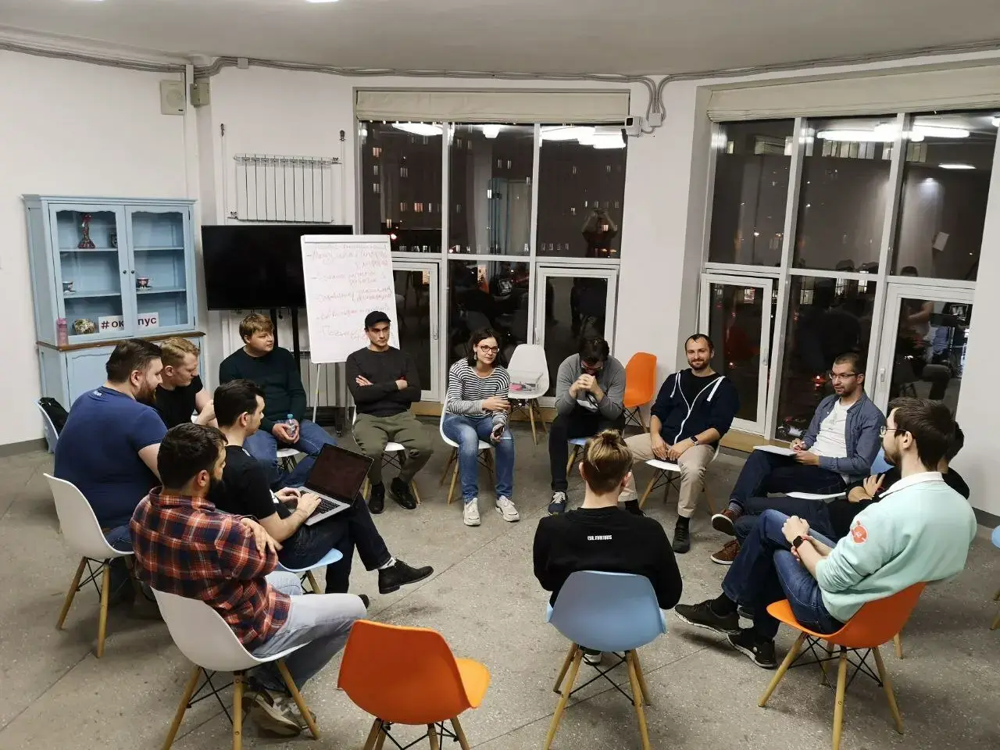

Recently I went to the DevOps Moscow openspace. From the outside, it may seem like an anonymous alcoholics club, but in reality, it's just ops discussing their current issues :)

Most of the meeting we discussed the pain of working with documentation. Either it's non-existent, outdated, or it has everything, but you can't find anything. We talked about how to deal with it.

## How to start using documentation
We started with the situation where you already have documentation, but you can't find anything in it, and because of that, no one uses it properly. How to solve this?

We began by making a list of tasks that you're trying to solve with documentation. It could be onboarding, sharing project knowledge within the team, broadcasting changes in your project to other teams, incident response, etc. Each task requires its own solution.

One thesis that was mentioned repeatedly was **you need to store information where you will look for it**. To understand where you will look, you need to outline scenarios of how users will access the documentation to solve each of the tasks.

Every time someone couldn't find something in the documentation and had to figure everything out on their own, it's necessary to convert such a case into a "task + usage scenario." This will help understand what's wrong with the documentation, as people aren't using it.

## Applied this approach to incidents
Task: We need engineers to quickly orient themselves during an incident. For example, we can write a page describing the project, a scheme, examples of how to fix something, but most often during an incident, no one will find and read this page. And this is where we need scenarios. They make it clear how to help an engineer come across a piece of documentation.

Scenarios by which an engineer understands that they have an incident and need to do something: Monitoring called, received an alert in Slack, looked at a graph in monitoring and realized that something is wrong.

Since the alert is the starting point of the scenario, let's provide a link to everything the person needs. The alert may contain links to documentation, the service repository, the Grafana dashboard, the latest deployment pipeline, etc. There's no need to search for anything; everything is at hand.

## Applied this approach to onboarding
Goal: the new person should get an idea of the project.
Scenario: the person has just arrived and does not understand where to look.

One way is to introduce the person through paired work with another engineer and not use documentation for onboarding.

Simulate an on-call! Great idea, I never thought of that))
Create a chat with fake alerts that will periodically come in during the week. And in the alerts, there are already links to everything that is needed. While trying to react to the alerts and check everything, the person will get familiar with the system and documentation.

## How to keep documentation up-to-date
If the team actively uses the documentation, then, as a rule, it leads to people regularly updating it, because they immediately notice deviations from reality.

You can additionally push the team to update the documentation by making it part of the work process. For example, make it part of the Definition of Done for each task. Make updating runbooks, dashboards, and documentation part of the process of closing an alert. Go through the documentation with a script in search of pages that have not been updated for a long time, and ask the team to update them.

In the case where new people often appear in the team, you can assign them tasks to do something with the documentation, asking questions and updating outdated places along the way.

After a meeting with Vitalik Khabarov, links on the topic were collected:
- [Knowledge management in project teams](https://github.com/NickVolynkin/teamleadconf-19/blob/master/source/km-meetup.md)
- [How to make sure documentation is healthy?](https://docops-hq.github.io/conf/teamleadconf/20/documentation_challenges/)
- [Meetup "Docs vs Knowledge"](https://drive.google.com/drive/folders/1hlcBGFPBaFSM9D7gOaFboF3hphd72BWR)

Links
- [DevOps Moscow Telegram chat](https://t.me/devopsmoscow)
- [My Telegram channel](https://t.me/aladmit_world)

P.S. We also discussed the problem of modular platform teams, but by that time I was already tired and did not take notes :(
