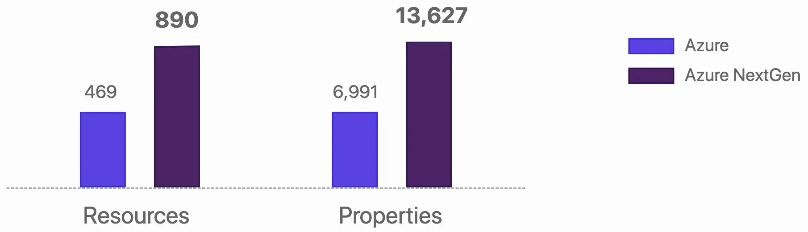

For Pulumi as a company, to go the route of building on top of terraform providers, rather than writing their own, was simply a brilliant idea. It allowed them to focus on developing unique features such as language support, testing frameworks, IDE integration, and so on. I won't list everything here; it's already covered in the talk at DevOps Moscow.

<iframe width="560" height="315" src="https://www.youtube.com/embed/uUwfSNF-vfk?start=1036" title="YouTube video player" frameborder="0" allow="accelerometer; autoplay; clipboard-write; encrypted-media; gyroscope; picture-in-picture; web-share" allowfullscreen></iframe>

However, despite the fact that such a move allowed them to quickly occupy their niche in the market, it also became a hindrance to further development. You cannot achieve fundamental superiority if a large part of your product's code is your competitor's code. Pulumi understands this very well, and that is why integration with Kubernetes was initially native [pulumi-kubernetes](https://github.com/pulumi/pulumi-kubernetes), and then grew into [kubernetesx](https://github.com/pulumi/pulumi-kubernetesx). This spring, the first native provider for the cloud, which is vastly different from everything that exists among competitors, is going into GA!

We are talking about [pulumi-azure-native](https://github.com/pulumi/pulumi-azure-native). The fundamental difference is that this is the first provider that covers 100% of the cloud API. If the cloud has a new feature, it appears in the provider within a few hours, without requiring the developers to be involved at all! This is achieved by generating the entire provider according to the cloud specs. Simply put, when new changes appear in the API spec, the CI generates a new release, all simple ¯\_(ツ)_/¯.

The announcement of the first public version of azure-native was made back in the fall, and even then its coverage level was almost twice as high as that of the azure provider working on top of terraform.

Switching to a native provider made it possible to add new features that were previously impossible to implement.

Top-level resources. This is when you use a resource without explicitly specifying the API version. In this case, Pulumi will choose the most stable version for you.

Auto-naming. The name of the entity in the cloud is automatically set and looks like *<resource name>-<random suffix>*. If the entity does not need to have a global name within the cloud, the suffix is not added. I actively use this feature in Kubernetes.

I am very pleased that Pulumi has made another evolutionary leap, and I hope for even more in the future :)

P.S. Recently I made a [pulumi provider for Yandex.Cloud](https://github.com/aladmit/pulumi-yandex). It is not yet available in the form of public packages, and there is no complete README, but if you are eager to start using it, you can write to me on Telegram [@aladmit](https://t.me/aladmit) or email me at aleksandrov@hey.com and I will help you get started.

Read more:
- [September announcement](https://www.pulumi.com/blog/announcing-nextgen-azure-provider)
- [Current status and transition to GA](https://www.pulumi.com/blog/full-coverage-of-azure-resources-with-azure-native/#native-to-azure)
- [How to migrate to the native provider](https://www.pulumi.com/docs/intro/cloud-providers/azure/from-classic/)
