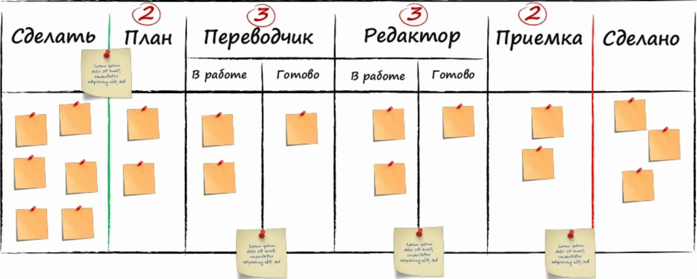

The essence: Kanban is not just a board, but a method for improving service quality.

## How to start using Kanban

To start using Kanban, you need to:

* Visualize the workflow
* Limit WIP
* Calculate Lead Time

Conclusions from Henrik Kniberg's book:

* there are no roles
* there are no meetings
* there are no masters
* there are no organizations or guides

Kanban is based on Lean paradigms: change management, flow, pull system.

Kanban principles:

1. Start with what you have now. We need to take the current process and apply Kanban rules to it.
2. Support acts of leadership at all levels. Support initiatives.

## Board

There should be two columns on the board for the backlog: to-do and plan. To-do is a classic backlog. Plan is what we agreed to do. i.e. we have deferred obligations.

On the board, there can be columns for specialists, such as Translator, Editor, Programmer, Tester. This column should be divided into two: in progress and done. Because just because the translator has finished his part doesn't mean the editor has started his.

#### In Scrum

There is a backlog with stories that are taken for a sprint and decomposed into tasks. Tasks are moved to the board.

#### In Kanban

These are not tasks, but work items that need to be worked on to move further along the process. Without WIP limits, the board is not a Kanban board. We limit the amount of work at the process stage. Without restrictions, there will be many blocked tasks that will not move because people will just take others. If there is a limit, people will think about what to take, what blockages will be, etc. Items will be taken one by one and processed together. After some time, joint work will become the norm, people will help each other and cross-functional teams will appear.

## Influence of WIP on work

Little's Law: `average wait time = queue size / processing speed`. And we can see it on the board. By changing the limit, we affect the flow.

Working with rules. We need to work with them, collect feedback and change them. The board is not static, but changes over time. For example, how we choose tasks from the backlog is also a rule. If Scrum says that the backlog should be prioritized, then Kanban says it depends on the situation. Sheets with DoD criteria and selection rules are hung on the board.

## SLA, CoS, CFD, FE based on Kanban statistics

If we build a histogram of the speed of an item passing through the process, we can see peaks that may be different types of work. i.e. We extract types of work from work statistics. From this, we can say that based on statistical data, tasks of such a type are done in such a time. Now, on a separate sheet, we can describe the criteria by which we understand the type of task.

Based on this same data, we can look at our attitude towards the task and make SLAs for different types of task importance.

To reflect this on the board, you need to introduce horizontal lines, and to prevent all tasks from suddenly becoming urgent, add limits. The sum of the limits of the horizontal lines should be equal to the sum of the limits of the columns. Priority on the Kanban board is built from top to bottom and from right to left.

Let's color our board and collect statistics for each color once a week by the number of sheets.

This is how the cumulative flow diagram (CFD) is built. The diagram shows Lead Time, WIP limit, and throughput. It is seen how we can influence our process according to the Pythagorean theorem. If we change the angle or the cathetus, we change the throughput.

According to the speed histogram of the element, you can understand what is happening with the production time. We make an averaged trend and if it goes up, it means the production time is increasing, if it goes down - it is accelerating. A threshold can be set, after which it is necessary to go talk to the team.

The workflow consists of work and waiting phases. We can calculate the length of the waiting phase and the length of work by time. This yields the flow efficiency (FE). `FE = Work Time / Production Time`.

## Cadences (Events)

#### In Scrum

Tied to the frequency of days

#### In Kanban

Frequency is absolutely different

### Daily Meeting

A person is selected who goes through the board from right to left and asks questions. What needs to be done to move the element, and can we help with something?

### Replenishment Meeting

At some point, a vacuum is formed, we all closed it. This means that we need to take on new tasks. In Scrum, the Product Owner chooses tasks, but this is not always possible and there may be many of them. Therefore, we gather everyone together and choose. It is desirable to have a facilitator.

### Delivery Planning Meeting

Agree in advance on the acceptance of tasks for delivery. If you have a CD, such meetings are not needed.

## Service Paradigm

* Your organization is an ecosystem of independent rule-driven services. Continuously measure and improve its effectiveness
* Manage work, give people an opportunity to organize around it
* Understand your customers, focus on their needs and expectations

### Ecosystem

This is a bunch of departments (services) in the company. Some services provide services to other services. We impose SLA on these services, about what requests can be and how many will be executed, and SLE, with customer expectations. In other words, each service has a purpose (Fitness For Purpose). We must strive to align SLE and SLA.

### Delivery Service Review

We gather with customers to discuss what we have done and what they expect from us in terms of service. It is recommended to hold it every 2 weeks.

### Operational Review

Representatives of services gather and discuss how they interact with each other.

### Risk Review

We take diagrams from different services and build chains to understand what needs to be done to make the global service work on time.

### Enterprise Services Planning

How to assemble the configuration of services within the company and how to plan its work.

## Scrumban

Application of Kanban principles in a mature Agile process.

## Summary

Kanban is a method for improving service quality.

### Contains

* 3 principles
* 6 practices
* 7 cadences
* 2 roles

### Metrics

* production time
* flow efficiency
* throughput

### Charts

* cumulative flow diagram
* spectral diagram
* control diagram

## Literature
* [Kanban: Alternative Path to Agile](https://www.goodreads.com/book/show/34994240-agile)
* [Essential Kanban Condensed](https://www.goodreads.com/book/show/30212820-essential-kanban-condensed)
* [The Scrumban Revolution: Getting the Most Out of Agile, Scrum, and Lean Kanban](https://www.goodreads.com/book/show/25953144-the-scrumban-r-evolution)

## Links
* [Presentation Recording](https://www.youtube.com/watch?v=lrDLbp0XeFA)
* [Slides](https://www.slideshare.net/ScrumTrek/kanban-74235710)
