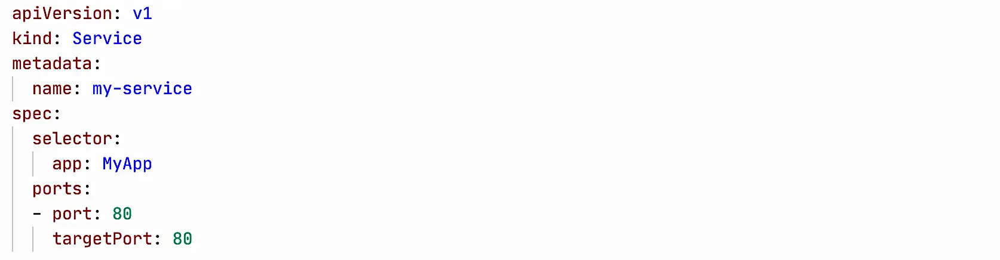
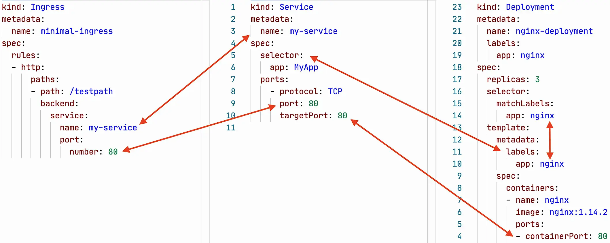
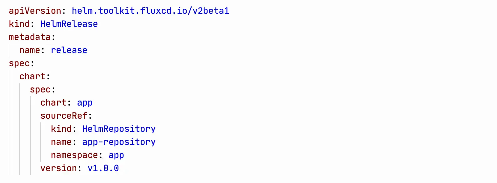
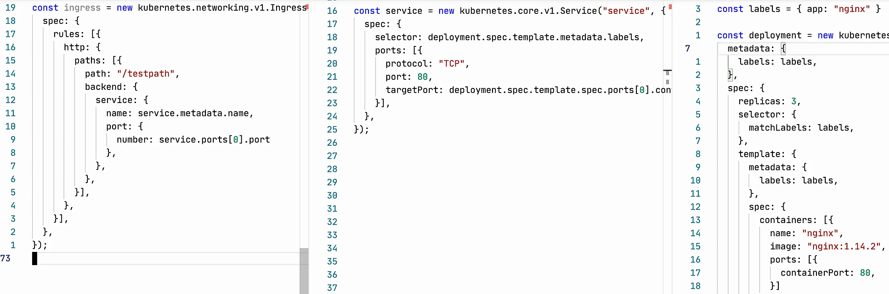
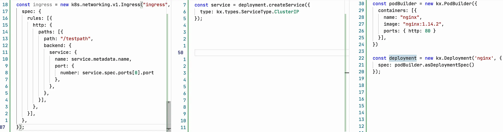
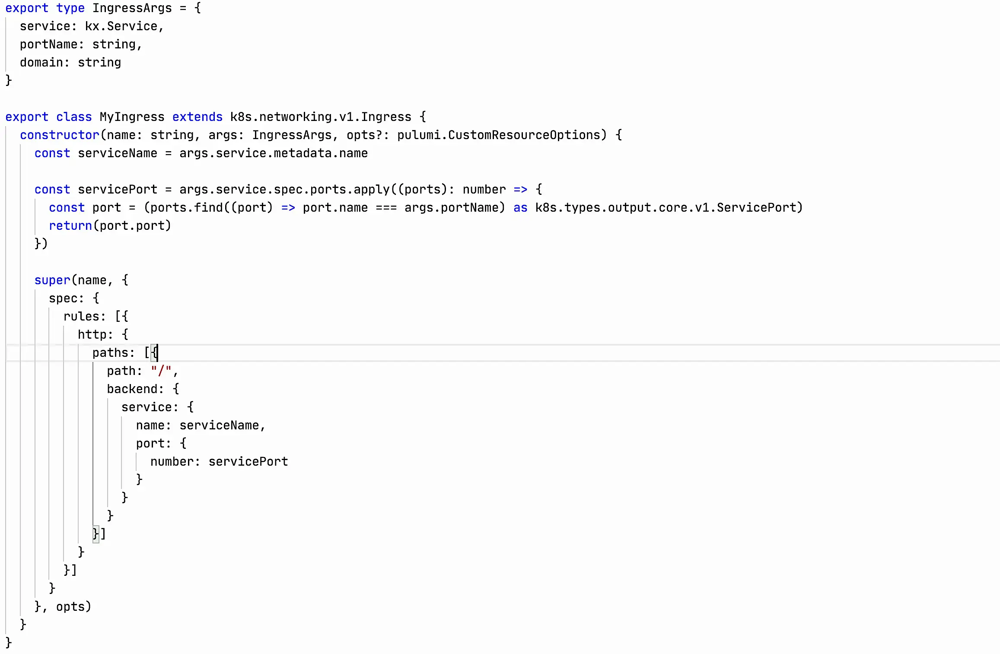
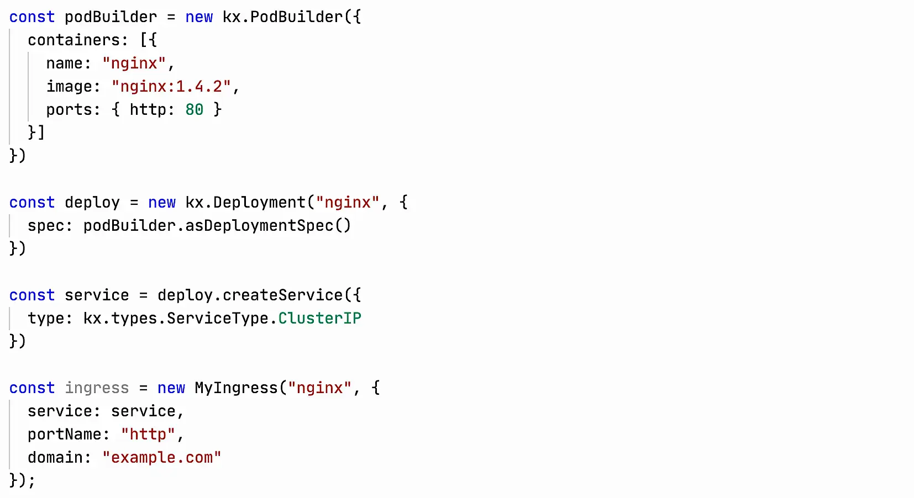
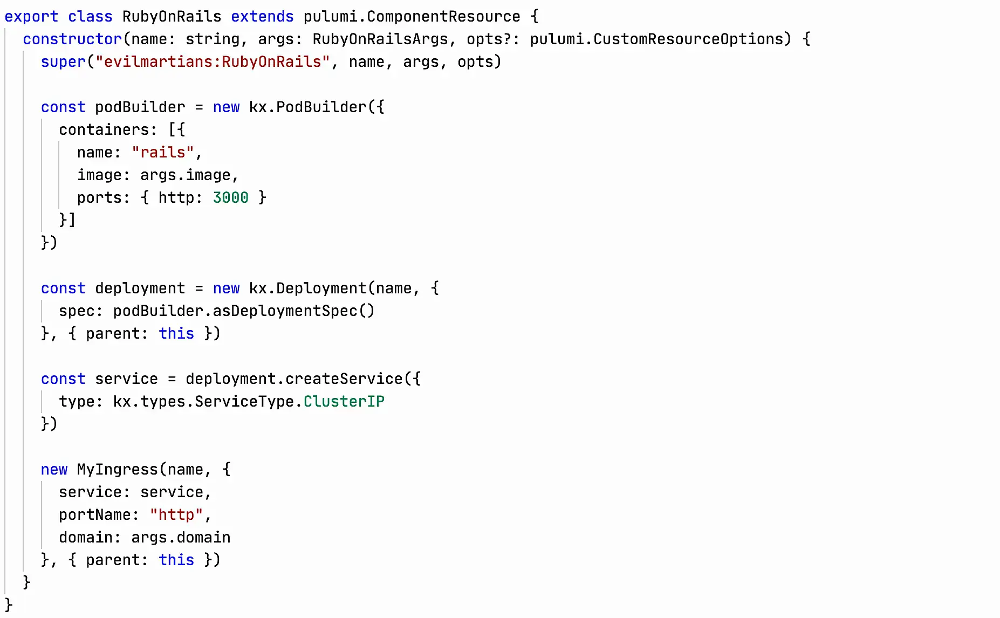

In the first couple weeks of working at Evil Martians, I've been looking at cube yAMLs and remembering how sad it all looks. YAMLs seem simple, but actually working with them creates many times more cognitive load than it would if it were code in a programming language.

Before I expand on the complexity idea, I'll first recognize the general advantages of the infrastructure management model Kubernetes has given us:

1. The code describes the result(declarative), not how to arrive at the result(imperative)  
2. There are basic objects that everyone understands in the same way  
3. the objects work the same way in any infrastructure and company.

## Where the complexity arises  

Individually and the objects themselves look and read pretty simple. Here's Service, for example. Everything looks simple and straightforward. We listen on port 80, direct traffic to **app: MyApp** on a port named **http**.

As long as we use a single object, all is well, but as soon as we start building an application infrastructure out of all the cubes, we face the need to hold back a huge amount of context to get it right. Why? Because **all objects have relationships between them, which YAMLs do not help manage or highlight in any way**.

Let's take the simplest use case of Ingress, Service and Deployment as an example.

Just 3 simple objects. Individually they look simple, but actually working with each of them requires keeping a bunch of object interaction specifics in your head.

What are the nuances of the links I have highlighted in the picture above:

**Ingress**  

1. _backend.service.name_ in Ingress must match _metadata.name_ in Service  
2. _backend.service.port.number_ must match _spec.ports.port_ in Service  
3. _metadata.name_ must be unique within a Namespace

Without these two items, Ingress will not be able to direct incoming traffic to the Service and its pods.

**Service**  

3. The _spec.selector_ in Service must match the _spec.template.metadata.labels_ in Deployment
4. The _spec.ports.targetPort_ in Service must match the _containerPort_ in Deployment
5. _metadata.name_ must be unique within a Namespace

Without these two items, Service will not be able to find pods created via Deployment and balance traffic on them.

**Deployment**  

6. _selector.matchLabels_ must match the labels part of _template.metadata.labels  
7. _metadata.name_ must be unique within a Namespace  
8. There's the added complexity of having _template.metadata.labels_

Deployment, without matching _labels_, won't be able to figure out how many pods it needs to keep track of. And we also need to make sure that these are unique _labels_ within the Namespace, otherwise Deployment might mistake another Deployment's pods for its own.

Look at this! Just 3 objects, and already 8 nuances have popped up that you need to know and keep in your head while writing all this! Not only that, it all needs to be maintained and when you change one entity, you need to make sure you don't break all these nuances. **Neither Kubernetes itself, nor specialized IDEs can point you to these nuances! You have to do everything with your own head! ** And this is a pretty simple example I took, without Job migrations, multiple Deployments in the application, StatefulSets, Secrets, PersistenVolumeClaim, etc.

## Why YAML is the problem

1. YAML files are just a static set of data structures that don't interact with each other at the code level and don't know anything about each other.
2. Linter or LSP cannot be written because the relationship between entities is too implicit and we cannot automatically determine which entities should be linked to which ones.
3. YAML cannot raise the level of abstraction and somehow simplify the work with generic entities.

Operators with a lot of linked CRDs try to solve this problem somehow, but all to no avail. The best example I've seen is Flux 2. Their HelmRelease entity references the HelmRepository entity as explicitly as possible.

Such a connection can already be checked in the IDE. However, except for Flux 2, almost nobody does this, and there is nothing like this in the basic cube entities.  

## How these problems are solved by programming languages

Full-fledged languages, unlike static data structures, give us tools to manage complexity: code reuse, explicit object relationships, abstractions.

There are enough tools with full-fledged languages for k8s.
For jsonnet code: [tanka](https://tanka.dev/), [jsonnet](https://jsonnet.org/articles/kubernetes.html), [kapitan](https://kapitan.dev/).
For typescript, javascript, python code: [cdk8s from AWS](https://cdk8s.io/) and [Pulumi](https://pulumi.com/). Pulumi also allows you to write code in Go and C#.

Terraform is also trying to make steps towards programming languages in [terraform-cdk](https://github.com/hashicorp/terraform-cdk), but it's in an experimental state, so I can't recommend using it yet.
  
I'll give a couple examples of solving problems with Typescript code, with Pulumi as the tool -- Pulumi. Just because I like this combination more than others ¯\_(ツ)_/¯

In this example, I wrote code as close as possible to the original yamla code, but already solving some of the problems.

**Ingress**  

Ingress takes the service name and port directly from Service. This allows us to explicitly see the relationship between these two entities, changes to Service fly to Ingress themselves, any IDE or editor will tell us if we somehow break this relationship. There will be a type mismatch error, an attempt to throw traffic from Ingress to a Service that doesn't exist, etc.

**Service**

Service has a similar story. The necessary data is taken directly from Deployment, the connection is explicit, we change it only in one place, IDE and compiler will not let us make a mistake. 
  
**Deployment**

Identical labels are guaranteed by putting them in a constant.

This way I have already solved most of the problems, my head has to think about much less nuances, and changing the code has become much easier. The only thing left is the need to remember that _labels_ in Deployment must be unique within the Namespace, and the port number retrieval is not very nice. The current solution has the potential to fire, but even as it stands there is much less to make a mistake.

Fortunately, this is not the limit of what can be done! Pulumi is developing a library [kubernetesx](https://github.com/pulumi/pulumi-kubernetesx) that raises the level of abstraction, takes away the complexity of managing all this horror.

This is an example on kubernetesx. There is much less code, it describes only what we really need, the library takes care of the rest. We describe how pod looks like, then kubernetesx will generate Deployment and Service by itself.

Yes, they haven't come up with a good abstraction for Ingress in kubernetesx yet, but you can make your own. I've sketched a simple version for an example:

It took me about 5 minutes to describe this abstraction. Yes, it is not perfect, but it already removes some of the problems from my poor head.

With this abstraction there is very little code and we don't need to think about the specifics of interaction between objects at all. The code has taken all the difficulties upon itself.

Since I've gone wild and started writing custom examples, let's go even further and make an abstraction for a typical application. In Evil Martians, for example, most of the services are written in RubyOnRails, you can make an abstraction for them that hides all the complexity of the cube from the developer and leaves only the context that is interesting to him.

This abstraction is just a wrapper over the code above, I wrote it in literally 1-2 minutes. The development now doesn't have to think about the cube at all! Yes, in the real world, the abstraction will be a bit more complex. For example, you'll need to add migrations, **_sidekiq: true | false_** and requests/limits, but it won't make the code any more complex :)

Abstraction code for Ruby On Rails:

## My conclusion

Kubernetes entities are quite complex, due to the fact that there are a lot of implicit relationships between them, YAML does not help us manage this in any way. Tools with full programming languages can reduce the amount of specifics you have to keep in your head, through explicit relationships using variables, typing, creating additional abstractions. The less you have to think about how it works, the less cognitive load and the less tired you get from working with all that mess!

If you want, you can quickly build abstractions for developers and make their lives easier too!

## Links
1.  Tools with full-fledged programming languages
    1.  [Pulumi](https://pulumi.com/)
        1.  [kubernetesx](https://github.com/pulumi/pulumi-kubernetesx)
        2.  [Creating your own abstractions with Component Resource](https://www.pulumi.com/blog/creating-and-reusing-cloud-components-using-package-managers/)
    2.  [cdk8s by AWS](https://cdk8s.io/)
    3.  [Terraform CDK](https://www.hashicorp.com/blog/cdk-for-terraform-enabling-python-and-typescript-support)
2.  Jsonnet tools
    1.  [tanka](https://tanka.dev/)
    2.  [jsonnet](https://jsonnet.org/articles/kubernetes.html)
    3.  [kapitan](https://kapitan.dev/).

### P.S.

After publishing I noticed that in the YAML code samples I have a different selector in Service from labels in Deployment. You can see how bad YAML is! 🤣