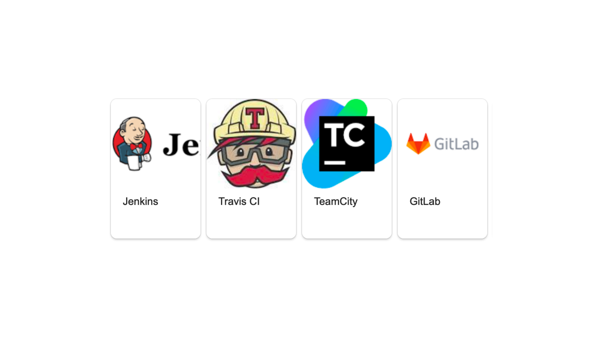

---
tags:
  - tbd
  - talk
published: 2020-09-08
description: Конспект моего доклада с DevOps Novosibirsk, где я раскрываю разницу между практикой и инструментом
title: Continuous Integration как практика, а не Jenkins
---
> Это полный конспект доклада с митапа DevOps Novosibirsk 2020-го года. Краткое содержание можно прочитать в блоге [enabling.team](https://enabling.team/insights/continuous-integration-as-practice)

<iframe class="rounded" width="560" height="315" src="https://www.youtube.com/embed/zZ3qXVN3Oic?si=SsdL2ceKsxIjKggS" title="YouTube video player" frameborder="0" allow="accelerometer; autoplay; clipboard-write; encrypted-media; gyroscope; picture-in-picture; web-share" referrerpolicy="strict-origin-when-cross-origin" allowfullscreen></iframe>

Обсудим почему CI-инструменты и CI – это совсем про разное.

Какую боль CI призвано решить, откуда возникла идея, какие последние подтверждения что оно работает, как понять что у вас есть именно практика, а не просто установленный Jenkins.

Мысль сделать доклад про Continuous Integration появилась еще год назад, когда я ходил по собеседованиям, искал работу. Пообщался с 10-15 компаниями, из них только одна смогла вразумительно ответить что такое CI и объяснить как они поняли, что у них этого нет. Остальные же несли невразумительную чушь про Jenkins :) Ну вот у нас есть Jenkins, он делает сборки, CI! За доклад постараюсь объяснить что же такое Continuous Integration на самом деле и почему Jenkins и подобные инструменты имеют очень слабое к этому отношению.

И так, что обычно приходит в голову при слове CI? Большинству людей придет в голову Jenkins, Gitlab CI, Travis и т.п.

Даже если мы загуглим, то нам выдаст эти инструменты.

Если спрашивать знакомы, то сразу после перечисления инструментов, вам расскажут что CI это когда у вас в Pull Request на коммит происходит сборка и прогон тестов.

Continuous Integration это не про инструменты, не про сборки с тестами в ветке! Continuous Integration это практика очень частой интеграции нового кода и для ее применения совершенно не обязательно городить Jenkins-ы, GitLab-ы и т.п.

Прежде тем мы разберемся как выглядит полноценный CI, давайте сначала погрузимся в контекст людей, которые это придумали, и прочувствуем ту боль, которую они пытались решить.

А решали они боль совместной работы в команде!

Давайте посмотрим на примерах, с какими сложностями сталкиваются разработчики при командной разработке. Вот у нас есть проект, master-ветка в git и два разработчика.

И пошли они работать как все давно привыкли. Взяли задачу в жире, завели feature branch, пишут код.

Один закончил фичу быстрее и смержил в мастер.

Второму понадобилось больше времени, он смержился позже и получил конфликт. Теперь, вместо того чтобы писать нужные бизнесу фичи, разработчик тратит свое время и силы на разрешение конфликтов.

Чем сложнее объединить свою фичу с общим мастером, Тем больше времени мы на это тратим. И это я еще достаточно простой пример показал. Это пример, где разработчиков всего 2. А представьте, если 10 или 15, или 100 человек в компании пишут в один репозиторий. Вы с ума сойдете все эти конфликты разрешать. 

Есть чуть-чуть другой случай. У нас есть мастер и несколько разработчиков, которые что-то делают.

Они создали по веточке.

Один смержился, все хорошо, сдал задачу.

Второй разработчик тем временем сдал свою задачу. Допустим, он отдал ее на ревью. Во многих компаниях есть практика – ревью. С одной стороны, это практика – хорошая и полезная, с другой стороны, это нас во многом где-то тормозит. Не будем в это погружаться, но вот отличный пример, к чему может привести кривая история с ревью. Вы отдали pull request на ревью. Разработчику больше нечего делать. Что он начинает делать? Он начинает брать другие задачи. 

За это время второй разработчик еще что-то поделал. 

Первый выполнил третью задачу. 

И спустя какое-то продолжительное время, его ревью опробовали, и он пытается смержиться. И что происходит? Он ловит огромное количество конфликтов. Почему? Потому что пока его pull request висел на ревью, в коде уже много чего поменялось. 

Помимо истории с конфликтами, есть история с коммуникациями. Пока у вас веточка висит на ревью, пока она чего-то ждет, пока вы долго пилите фичу, вы перестаете отслеживать, что еще в кодовой базе вашего сервиса меняется. Возможно, то, что сейчас вы пытаетесь решить, это уже решили вчера и можно взять и какой-то метод переиспользовать. Но вы этого не увидите, потому что вы работаете всегда с устаревшей веткой. И эта устаревшая ветка всегда приводит к тому, что вам придется разрешать мерж-конфликт. 

Получается, что если мы работаем командой, т. е. не один человек в репозитории ковыряется, а человек 5-10, то чем дольше мы не добавляем свой код в мастер, тем больше мы страдаем оттого, что на в конечном итоге нужно что-то смержить. И чем больше у нас конфликтов, и чем с более старой версией мы работаем, тем больше у нас проблем.

Совместно что-то делать – это больно! Мы друг дружке всегда мешаем. 

На эту проблему обратили внимание 20 с лишним лет назад. Первое упоминание о практике Continuous Integration я нашел в экстремальном программировании.

Экстремальное программирование – это первый agile framework. Страничка появилась в 96-ом году. И была идея использовать какие-то практики программирования, планирования и прочего, чтобы разработка была как можно более гибкой, чтобы мы могли быстрее реагировать на какие-то изменения, требования от наших клиентов. И они 24 года назад начали с этим сталкиваться, что если ты делаешь что-то очень долго и в стороне, то ты тратишь на это больше времени, потому что у тебя конфликты. 

Сейчас мы разберем словосочетание «Continuous Integration» по отдельным словам. Если переводить в лоб, то получается непрерывная интеграция. Но насколько она непрерывная не очень понятно, она очень даже прерывная. Но сколько она integration тоже не очень очевидно. 

И поэтому я привожу вам сейчас цитаты из экстремального программирования. И мы оба слова разберем по отдельности. 

Integration - Как я уже сказал, мы стремимся к тому, чтобы каждый инженер работал с самой актуальной версией кода, чтобы он свой код стремился добавлять как можно чаще в общую веточку, чтобы это были маленькие веточки. Потому что если они большие, то можем в легкую на неделю застрять с мерж-конфликтами. Особенное, если у нас длинный цикл разработки типа waterfall, где разработчик ушел на месяц пилить какую-то огромную фичу. И он на этапе интеграции застрянет очень надолго. 

Integration – это когда мы берем свою веточку и интегрируем ее с мастером, мы ее мержим. Есть ультимативный вариант, когда мы transbase developer, где мы стремимся к тому, что мы сразу в мастер пишем без всяких лишних веточек.

В общем, integration – это взять свой код и дотащить его в мастер. 

Что здесь подразумевается под словом «continuous», что называется непрерывностью? Практика подразумевает, что разработчик стремится интегрировать свой код как можно быстрее. Это его цель при выполнении любой задачи – сделать так, чтобы его код появился в мастере, как можно быстрее. В идеальном мире разработчики будут это делать каждые несколько часов. Т. е. ты берешь маленькую задачку, мержишь ее в мастер. Все замечательно. Ты к этому стремишься. И делать это надо непрерывно. Как только ты что-то сделал, ты сразу же это вгоняешь в мастер. 

И разработчик, который что-то делает, является ответственным за то, что он сделал, чтобы это работало и ничего не сломало. Вот здесь обычно и вылезает история с тестами. Мы хотим прогнать какие-то тесты на наш коммит, на наш мерж, чтобы убедиться, что это работает. И здесь вам могут как раз помочь Jenkins.

Но с историями: а давайте изменения будут маленькими, а давайте задачки будут маленькими, а давайте мы задачку сделаем и сразу же попытаемся как-то вмержить ее в мастер – вот здесь никакие Jenkins не помогут. Потому что Jenkins вам помогут исключительно запустить тесты. 

Вы можете обойтись и без них. Это вам нисколько не помешает. Потому что цель практики – это мержится как можно чаще, чтобы не тратить огромное количество времени на какие-то конфликты в будущем. 

Представим, что у нас 2020-ый год почему-то без интернета. И мы локально работаем. У нас нет Jenkins. Это нормально. Вы все еще можете взять и сделать локальную веточку. Вы в ней написали какой-то код. Сделали задачку за 3-4 часика. Переключились на мастер, сделали git pull, вмержили туда свою ветку. Готово. Если вы это делаете часто – поздравляю, у вас есть Continuous Integration!

Какие в современном мире есть пруфы на тему того, что на это стоит тратить силы? Потому что в целом это сложно. Если вы попробуете так поработать, то вы поймете, что у вас сейчас затронется какое-то планирование, вам придется больше времени уделять декомпозированию задач. Потому что если вы будете делать man…, то вы смержиться не сможете быстро и, соответственно, попадете в просак. Практики у вас уже не будет. 

И это будет дорого. Работать сразу с завтрашнего дня по Continuous Integration не получится. Вы все будете очень долго привыкать, очень долго будете приучаться декомпозировать задачи, очень долго будете приучаться переделывать практику ревью, если она у вас есть. Потому что наша цель, чтобы оно смержилось сегодня. А если вы ревью делаете в течение трех дней, то у вас проблемы и Continuous Integration у вас не получается. 

Но какие-то у нас есть актуальные пруфы прямо сейчас, которые нам говорят, что инвестировать в эту практику имеет смысл?

Первое, что мне пришло в голову – это State of DevOps. Это исследование, которое ребята проводят уже 7 лет. сейчас они это делают как независимая организация, но под Google.

И их исследование в 2018-ом году показало корреляцию между компаниями, которые стараются использовать короткоживущие веточки, которые интегрируются быстро, интегрируются часто, у них более красивые показатели производительности IT.

Что это за показатели? Это 4 метрики, которые они снимают со всех компаниях в своих опросниках: deployment frequency, lead time for changes, time to restore service, change failure rate.

И, во-первых, есть вот эта корреляция, мы знаем, что компании, которые мержатся часто, у них эти метрики сильно лучше. И у них есть разбиение компаний на несколько категорий: это медленные компании, которые производят что-то медленно, medium performer, high performer и элита.  Элита – это Netflix, Amazon, которые супершустрые, все делают быстро, красиво и качественно.

Вторая история, которая произошла буквально месяц назад. В Technology Radar появилась замечательная заметка о Gitflow. Gitflow отличается от всех остальных тем, что его ветки живут долго. Есть релизные ветки, которые долго живут, фичи branches, которые тоже долго живут. Эта практика в Technology Radar переместилась в HOLD. Почему? Потому что люди сталкиваются с болью интеграции.

Если у тебя ветка живет очень долго, она встревает, протухает, мы начинает тратить больше времени на то, чтобы внести в нее какое-то изменение.

И недавно автор Gitflow сказал, что если вы стремитесь к Continuous Integration, если вы стремитесь к тому, что вы хотите катиться как можно чаще, то Gitflow – это плохая идея. Он отдельно в статью дописал, что если у вас бэкенд, где вы можете к этому стремится, то Gitflow для вас лишний, потому что Gitflow вас замедлит, Gitflow вам создаст проблемы с интеграцией.

Это не означает, что Gitflow плохой и им не надо пользоваться. Он для других случаев. Например, когда вам нужно поддерживать несколько версий сервиса, приложения, т. е. где вам нужно саппортить в течение какого-то продолжительного периода времени.

Но если вы пообщаетесь с людьми, которые такие сервисы поддерживают, то вы услышите много боли о том, что эта версия была 3.2, которая была 4 месяца назад, а в нее не попал этот фикс и теперь, чтобы его внести, нужно внести кучу изменений. И вот они снова застряли, и вот они неделю ковыряются с тем, чтобы взять и смержить какую-то новую фичу. 

Как Александр Ковалев правильно заметил в чате, корреляция – это не равно причинно-следственной связи. Это так. Т. е. какой-то прямой связи, что если у вас Continuous Integration, то все метрики будут шикарными, нет. Но есть положительная корреляция, что если одно, то, скорее всего, другое тоже. Не факт, но, скорее всего. Это всего лишь корреляция. 

Вроде бы мы уже что-то делаем, вроде бы мы уже мержимся, но как понять, что Continuous Integration у нас все-таки есть, что мержимся достаточно часто?

Jez Humble – это автор Handbook, Accelerate, сайта Continuous Delivery и книжки «Continuous Delivery». Он предлагает вот такой тест:

- Код инженера попадает в мастер ежедневно;
- На каждый коммит вы запускаете unit-тесты;
- Билд в мастере упал, его починили примерно за 10 минут.

Он предлагает использовать такой тест, чтобы убедиться, что практика у вас точно есть. 

Последнее я нахожу немножко спорным. Т. е. если вы можете починить за 10 минут, значит, у вас есть Continuous Integration, звучит немножко странно, на мой взгляд, но в этом есть смысл. Почему? Потому что, если вы мержитесь часто, это значит, что изменения у вас маленькие. Если маленькое изменение к тому, что у вас сломалась сборка мастера, то вы сможете найти пример быстро, потому что изменение маленькое. Вот у вас был маленький мерж, в нем изменились 20-30 строчек. И, соответственно, вы можете быстро понять, в чем была причина, потому что изменения крохотные, у вас очень маленькая область поиска проблемы. 

И даже если у нас после релиза разваливается prod, то если у нас есть практика Continuous Integration, нам сильно проще действовать, потому что изменения крохотные. Да, это затронет планирование. Это будет больно. И, наверное, самое сложное в этой практике – это привыкнуть разбивать задачки, т. е. как сделать так, чтобы взять что-то и сделать это за несколько часов и при этом пройти ревью, если оно у вас есть. Ревью – это отдельная боль. 

Unit-тесты – это просто помощник, который вам помогает понять – точно ли ваша интеграция прошла успешно, точно ли ничего не сломалось. На мой взгляд, это тоже не совсем обязательный пункт, потому что смысл практики не в этом. 

Это кратенько про Continuous Integration. Это все, что есть в этой практике. Я готов к вопросам. 

Кратко только еще раз подведу итоги:
- Continuous Integration – это не Jenkins, это не Gitlab;
- Это не инструмент, это практика о том, что мы как можно чаще мержим наш код в мастер;
- Делаем мы это для того, чтобы избежать огромной боли, которая возникает с мержами в будущем, т. е. мы испытываем маленькую боль сейчас, чтобы не испытывать большую в будущем. В этом весь смысл;
- С боку проходит коммуникация через код, но я этого очень редко вижу, но для этого она тоже задумывалась.

## Ссылки

- [Запись](https://youtu.be/zZ3qXVN3Oic)
- [Презентация](https://github.com/aladmit/public/blob/main/pdfs/Continuous%20Integration%20%D0%BA%D0%B0%D0%BA%20%D0%BF%D1%80%D0%B0%D0%BA%D1%82%D0%B8%D0%BA%D0%B0.pdf)
- [Версия конспекта с вопросами из зала](https://github.com/patsevanton/russian-conferences-articles/blob/master/articles/%D0%90%D0%BD%D0%B4%D1%80%D0%B5%D0%B9-%D0%90%D0%BB%D0%B5%D0%BA%D1%81%D0%B0%D0%BD%D0%B4%D1%80%D0%BE%D0%B2-Continuous-Integration-%D0%BA%D0%B0%D0%BA-%D0%BF%D1%80%D0%B0%D0%BA%D1%82%D0%B8%D0%BA%D0%B0-%D0%B0-%D0%BD%D0%B5-Jenkins.md)
- [@patsevanton](https://t.me/@patsevanton) - автор конспекта по докладу
