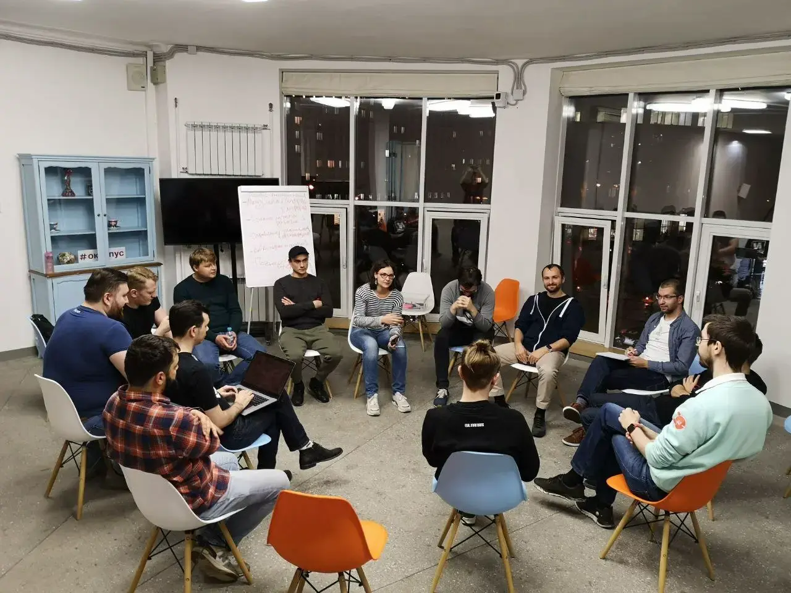
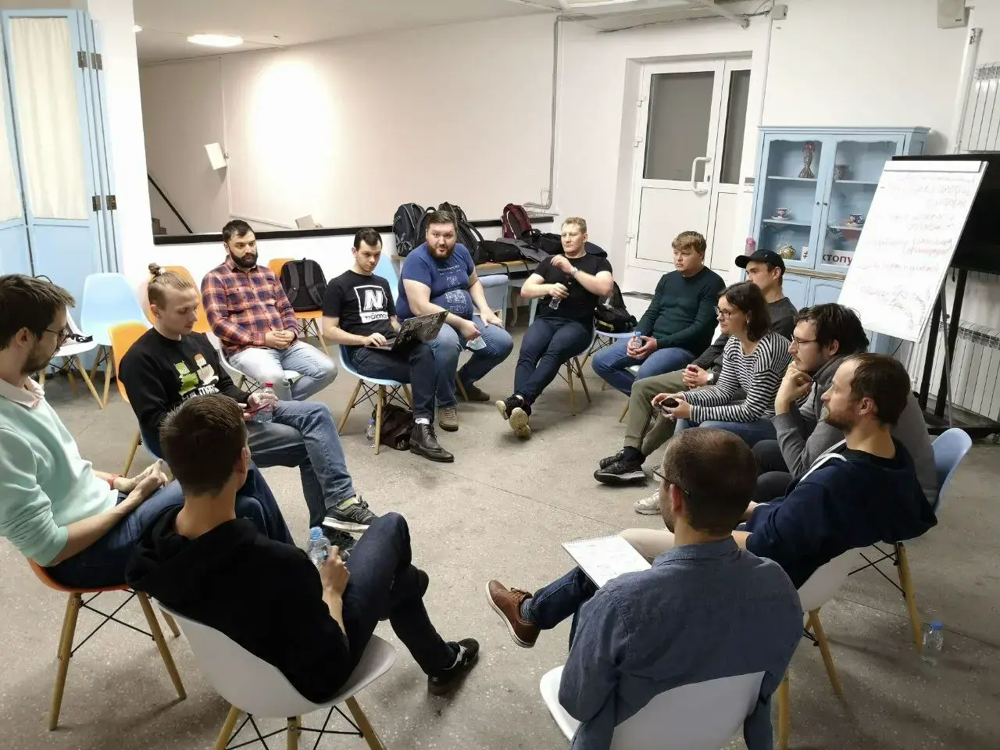

На днях сходил на DevOps Moscow опенспейс. Со стороны может показаться, что это клуб анонимных алкоголиков, но на самом деле это просто опсы, которые обсуждают свои текущие проблемы :)

Большую часть встречи мы обсуждали боль работы с документацией. То в ней ничего нет, то она устаревшая, то в ней все есть, но ничего найдешь. Обсудили как с этим жить.

## Как начать пользоваться документацией
Разговор начали с ситуации,  когда документация у тебя уже есть, но в ней ничего не найдешь и из-за этого ей толком никто не пользуется.  Как этого добиться?

Начали со списка задач, которые ты пытаешься решить документацией. Это может быть онбординг, шаринг знаний о проекте внутри команды, трансляция изменений в вашем проекте другим командам, реагирование на инцидент и т.д. Каждая задача потребует своего решения.

Ни раз прозвучал тезис **хранить информацию нужно там, где ты будешь ее искать**. Чтобы понять, где ты будешь искать, нужно расписать сценарии, как пользователи будут обращаться к  документации для решения каждой из задач. 

Каждый раз, когда кто-то не смог что-то найти в документации, разбирался во всем сам, нужно конвертировать такой случай в "задача + сценарий использования". Это поможет понять что с документацией сейчас не так, раз ей не пользуются.

## Применили такой подход к инцидентам
Задача: нам нужно чтобы инженер быстро ориентировался что где во время инцидента. Можно, например, написать страничку с описанием проекта, схемой, примерами как что можно починить, но чаще всего во время инцидента эту страничку никто не найдет и не прочитает. И вот для этого нам и нужны сценарии. По ним понятно как помочь инженеру наткнуться на кусок документации.

Сценарии, по которым инженер понимает что у него инцидент и надо что-то делать: позвонил мониторинг, получил алерт в Slack, посмотрел на график в мониторинге и понял что что-то не так.

Раз алерт у нас является точкой начала сценария, давайте ее снабдим ссылкой на все что человеку нужно. В алерте могут быть ссылки на документацию, репозиторий сервиса, дашборд в графане, последний пайплайн деплоя и т.д. Не нужно ничего искать, все под рукой.

Когда график является началом сценария, можно сделать то же самое. Выделять цветом участки, которые показывают что что-то не так, это поможет инженеру в момент аварии не задумываться как трактовать график. В описание каждого графика добавить описание, что он показывает, почему такие-то значения это плохо, и ссылку на документацию с описанием что делать, если с этим графиком все плохо.

## Применили такой подход к онбордингу
Задача: у нового человека должно появиться представление о проекте.
Сценарий: человек только пришел и не понимает куда смотреть.

Можно вводить человека через парную работу с другим инженером и не использовать документацию для онбординга.

Симулировать он-колл! Шикарная идея, мне такое в голову никогда не приходило))
Сделать чат с фейковыми алертами, которые будут периодически прилетать в течение недели. А в алертах уже есть ссылки на все что нужно. Пока пытается реагировать на алерты и все проверять, человека разберется в системе и познакомиться с документацией.

## Как добиться актуальности документации
Если команда активно пользуется документацией, то, как правило, это приводит к тому что люди начинают ее регулярно обновлять, потому что сразу замечают ее отклонения от реальности.

Можно дополнительно подтолкнуть команду к обновлению документации, сделав это частью процесса работы. Например, сделать это частью Definition of Done каждой задачи. Сделать обновление ранбуков, дашбордов, документации частью процесса закрытия алерта. Проходить скриптом по документации в поисках страниц, которые давно не обновлялись, просить команду их обновить.

В случае, когда в команде часто появляются новые люди, можно ставить им задачи сделать что-то по документации, задавая по ходу дела вопросы и обновляя неактуальные места.

После встречи Виталик Хабаров накидал ссылок на тему:
- [Управление знаниями в проектных командах](https://github.com/NickVolynkin/teamleadconf-19/blob/master/source/km-meetup.md)
- [Как сделать так, чтобы документация не болела?](https://docops-hq.github.io/conf/teamleadconf/20/documentation_challenges/)
- [Митап "Доки против знаний"](https://drive.google.com/drive/folders/1hlcBGFPBaFSM9D7gOaFboF3hphd72BWR)

Ссылки
- [DevOps Moscow Telegram chat](https://t.me/devopsmoscow)
- [Мой телеграм канал](https://t.me/aladmit_world)

P.S. Еще обсуждали проблему модульных платформенных команд, но я к этому времени уже устал и не делал заметок :(
