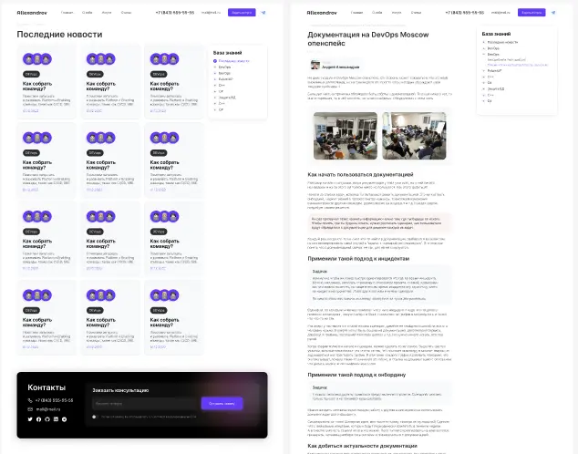
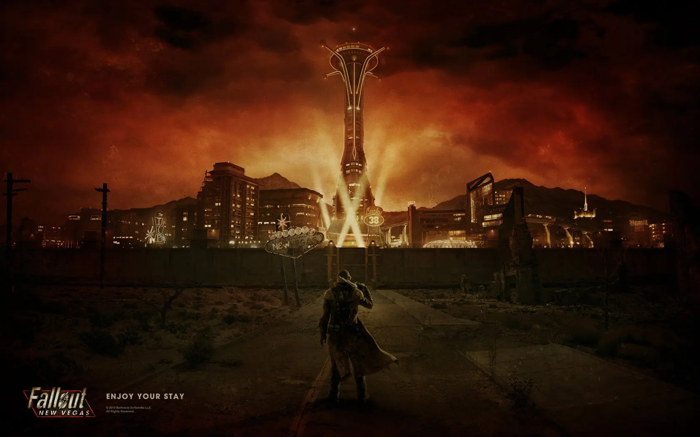
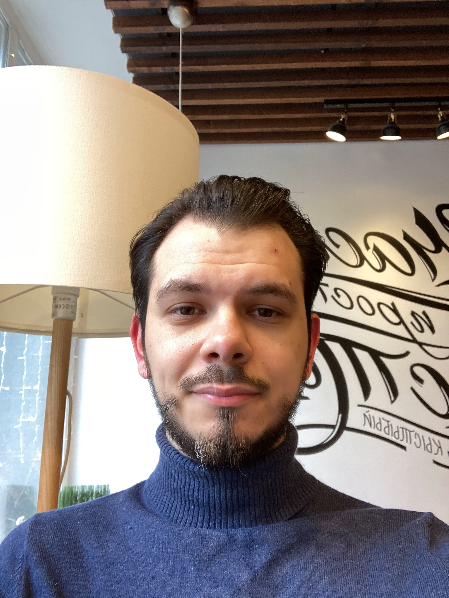
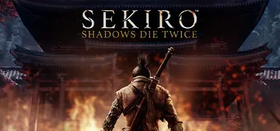
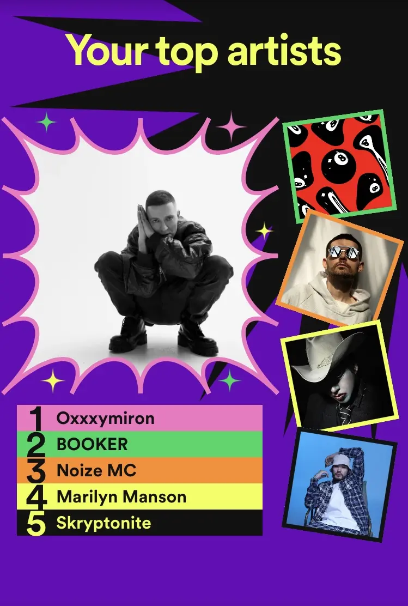

## Профессиональные итоги

### Смещение фокуса

Я всегда был тем парнем, который старается усидеть на всех стульях сразу:
разработка, менеджмент, орг дизайн, инженерные практики, эксплуатация. Основные
деньги зарабатывал последним, работая ~~DevOps'ом~~ SRE. Однако за весь 2022 год
я не прочитал ни одной чисто инфраструктурной новости. Мне не хотелось ничего
узнавать ни про кубер, ни про амазон, ни даже про pulumi. Не интересно и все.
Зато я с удовольствием продолжал расширять свои компетенции по орг дизайну,
командам и практикам разработки, а мир по чуть-чуть подкидывал мне разные
активности на эти темы.

В конце ноября мы с [Evil Martians](http://evilmartians.com) официально
расстались, и это была последняя ниточка, которая как-то меня связывала с миром
эксплуатации. Решил что в 2023 году я буду фокусироваться только на
[enabling.team](https://enabling.team), а там и процессы, и команды, и практики
разработки, и блог 😜

### enabling.team

В 2022м [enabling.team](https://enabling.team) было для меня скорее
второстепенной активностью, но даже так я успел поделать всякого. Проекты по
обучению, Q&A, R&D.

У нас появился кастомный поиск по отобранным экспертам и блогам компаний.
Обращаться к опыту индустрии стало гораздо проще 🤓 На основе опыта проектов по
Team Topologies и воркшопов на конференциях сформировались инструменты
диагностики команд: Teamlinter и Orgcode. Думаю, это все должно хорошо
смотреться как часть HR Tech, IDP или PaaS. Напиши, если интересны наши
наработки для твоих внутренних систем и порталов.

Есть идея запустить портал
[PlatformEngineering.ru](https://platformengineering.ru). Собрать в одном месте
экспертов, платформы от разных компаний, материалы и фреймворки, чтобы
получилась общая независимая точка входа в эту тему. Пока на этапе концепции.
Накидали как это может работать, чем будет отличаться, какую уникальную пользу
может приносить. Напиши, если тебе интересно поучаствовать в этой движухе.

[Опубликовали Итоги года](https://enabling.team/2022), там можно подробнее
прочитать что еще интересного мы сделали за год.

### Trunk Based Development

Чем конкретно занимался:
- проводил вебинар про TBD для команды Яндекс.Практикума. Презентацию и
первоисточники планирую выложить уже после того как закончу обновление дизайна
блога;
- описывал для компании план перехода с Git Flow на TBD;
- рассказывал про нюансы сочетания тестирования и высокого темпа разработки при
TBD;
- под конец года две компании пришли за помощью по TBD и смежным практикам,
обсуждение продолжиться уже в 2023 году.

Это уже не первый год, когда я помогаю кому-то с TBD. Материалов накопилось
довольно много, есть понимание нюансов и проблем с TBD в командах. В 2023 годом
займусь публикацией своих мыслей на эту тему, возможно, оформлю что-то в виде
курса. Напиши, если тебе интересен курс, воркшоп по этой теме, или нужна помощь
в конкретной команде.

### Блог

Написание статей всегда было для меня большой болью. Писать на блог платформах
жутко неудобно, поэтому пишу в чем-то локальном. Нужна схемка? Доставай ipad или
корячься в drawio, а потом экспортируй, переноси это все в статью и повторяй
каждый раз, когда что-то поменялось. Текст готов? Теперь нужно сидеть и ручками
переформатировать все под конкретную платформу, загружать и расставлять
картинки, править ссылки, и вот опять куча времени ушла на фигню. Отвратительно,
как представлю что мне нужно пройти через весь этот бардак, сразу желание писать
пропадает.

К счастью, осенью мне удалось решить вообще все эти проблемы. 🚀 Закатал рукава,
взял [Obsidian](http://obsidian.md), [Excalidraw](https://excalidraw.com),
[Astro](http://astro.build), TypeScript и тесно это все между собой поженил. Я
пишу в максимально удобном для меня инструменте, прямо в нем же, среди текста,
рисую иллюстрации и добавляю картинки, а потом в один клик это все
экспортируется и улетает на сайт. Между мной и публикацией не осталось ни одного
барьера, остался только чистый кайф написания статьи 💗 В качестве бонуса, раз
посты теперь являются частью моей базы знаний, они будут вместе с ней и
обновляться. Никогда такого раньше не делал, посмотрим как пойдет.

Еще пробовал сделать большой скетч по State of DevOps 2022. Не было понимания
как это делать, как это может выглядеть,  что важно, а что можно выбросить. В
итоге прошлось делать разные варианты, потратить на это уже больше 60 часов и
так до сих пор и не закончить. Доделаю, раз уж начал, но эксперимент признаю
провальным. Затратный, заблокировал процесс публикации других статей и пока не
уверен, что я хоть еще раз ввяжусь во что-то подобное.

Всего за год написал 2 небольшие статьи, 8 сообщений в тг канал, недоделанный
скетч. Это скромнее, чем было 2021 году, но зато позволит мне активнее писать в
2023, а внешний вид блога будет заточен под чтение лонгридов.

### obsidian-annotator

Стал мейнтейнером
[obsidian-annotator](https://github.com/elias-sundqvist/obsidian-annotator).
Плагина для Obsidian, который позволяет читать, хайлайтить и комментировать PDF,
EPUB, сайты и видео с ютуб прямо в Obsidian. Все хайлайты и комментарии
сохраняются в виде цитат прямо в заметке, что позволяет на них ссылаться и
цитировать их по всей базе знаний.

Над чем работал, помимо принятия PR и ответов в issues:
1. Contribution guide
2. Настройка в каком режиме открывать заметку
3. Настройка размера шрифта при чтении EPUB
4. Режим бесконечной страницы для EPUB
5. Убрал лишнее пустые рамки вокруг страниц, чтобы контент занимал максимум пространства
6. Потихоньку перевожу код на строгий TS

Плагин состоит из кучи third-party компонентов, в комьюнити не нашлось готовых
вариантов интеграционного тестирования такого зоопарка, в итоге плагин
тестируется вручную и баги просачиваются в каждый релиз. 🙈 Собрал на коленке
вариант как можно запускать Obsidian и автоматически тестировать это все, но
пока слишком сыро для релиза, выкачу в 2023м.

## Личная жизнь

### "War... War never changes"

Из всего текста, про эту часть жизни писать страннее всего. Может,
проигнорировать? Сделать вид, что жизнь не делилась на "до" и "после", что все
хорошо, ничего не происходит. Но это же вранье. Зато безопасное вранье! Берешь,
замираешь, и сидишь. Надеешься что ты не следующий в очереди в шеренгу или в
местный лагерь. Что минус один повод государству до тебя доебаться как-то
поможет пройти через это все с минимальным ущербом.

Грустно признавать, что во всей этой десятилетней зарубе победителем вышло
государство. Активные посажены, громкие выдавлены, дерзкие убиты. Победа
оказалась на столько разгромной, что разделения на "за" и "против" больше нет.
Есть те кого все устраивает, и те кто оцепенел и больше не верит что может на
что-то повлиять.

#### Помощь с границами и санкциями

Много рассказывал про криптовалюты людям, которых вообще никогда не ожидал
увидеть в этой теме. Кто-то застрял в другой стране, а карточки не работают,
доступа к деньгам, надо выкручиваться. Кто-то покидал Россию и хотел возить с
собой деньги в обход таможенных ограничений разных стран. Кто-то хотел
поддерживать деньгами своих родных в России, Украине, Европе, Азии и бог знает
где еще, а переводы либо совсем накрылись, либо только очень больших сумм.
Здорово, что мое куцее понимание крипты помогло людям справиться с этим всем.

И еще я очень рад, что нам пока все еще доступны финансовые инструменты, живущие
вне политики и контроля государств. Да они жутко неудобные, да ими сложно
воспользоваться, да волатильность и риски, но в современных условиях глобального
мира это пока лучший доступный нам способ защиты своих денег от прихотей
государств и их институтов.

### Здоровье

Пожалуй, я никогда так много не болел, как в этом году 🙈 Январь, февраль –
проболел полностью. Вынырнул, пришел в себя, восстановился, почувствовал что все
снова ок, наступил май и я рухнул обратно. Потом в июле. Еще раз в сентябре,
коронный в октябре. К счастью, с тех пор все как-то улеглось, стабилизировалось.
Прихожу в 2023 в достаточно здоровом состоянии, чтобы снова планировать на
большой срок, коммититься на большие штуки и не бояться что я вот сейчас опять
разболеюсь и все пойдет наперекосяк.

На удивление, во всех этих проблемах со здоровьем была и польза. Так много
времени провел наедине со своими мыслями, что мир стал как-то по другому
восприниматься. Каждое падение я садился, думал, повышал уровень детализации
всех происходящих в моей жизни процессов, подмечал их сложность, замечал больше
переменных. При этом работать с этой сложностью и переменными, напротив,
становилось все легче и проще.

Не знаю. Обычного, после решения какой-то сложной задачи, у меня возникает
ощущение, что я поумнел. А тут я скорее первый раз в жизни помудрел.

### Борода

Это весенняя фотка, борода с тех пор стала гуще и объемнее, а я выгляжу не таким
уставшим, но актуальной фотки, которая бы мне нравилась, у меня нет)) Оказалось,
борода это на столько резкое изменение внешности, что меня иногда совсем не
узнают 😅

Раньше я не мог представить себя с бородой, думал что это будет плохо
смотреться. В 2022 году все поменялось, борода стала нравиться, восприниматься
очень органично. Как будто бы она создана специально для демонстрации ощущения
"мне сейчас просто с тем что на самом деле очень сложно". Ну и для того чтобы
незнакомые люди для приветствия вместо "Здравствуйте" говорили "Ас-саляму
алейкум", конечно 🧔😆

### Спорт

В этом году первый раз попробовал йогу, но в итоге забросил >.< Было заметно как
асаны снимают напряжение в мышцах, быстро сообразил какие асаны хороши для
помощи каким мышцам, но заниматься этим всем мне почему-то было совсем не
интересно. Чувствовал себя легче, но заниматься этим регулярно совсем не
хотелось.

Перешел к растяжке. Я всю жизнь был деревянным, несгибаемым, при наклонах вперед
ладони еще со школы не опускались ниже уровня коленей. А вот к новому году я с
растяжкой пришел к крутым результатам! Первый раз в жизни я могу наклониться и
коснуться пальцами пола! Охренеть просто! Ничего не болит, ничего не тянет, все
комфортно и легко 😮 Сама идея этим заняться пришла после того как ютуб подсунул
мне shorts от [@MovementbyDavid](https://www.youtube.com/@MovementbyDavid) на
ютубе.

Опять пытался во Freeletics(приложение для кроссфита дома), но заменил
калистеникой. Freeletics слишком уж быстро переходит в жесть. Сбрасывал
приложение, пересоздавал профиль, отвечал роботу что мне очень тяжко, но
проходит пару дней и тренировки становятся на столько тяжелыми, что я не успеваю
восстанавливаться и удалбливаюсь все больше и больше. Калистеника это тоже
силовые, тоже с собственным весом, но идея в том чтобы медленно увеличивать
сложность упражнений. Например, начинаешь с отжиманий от стеночки, потом на
коленях, со временем переходишь к отжиманиям от пола, и так по чуть-чуть
добираешься до отжиманий на одной руке. Сейчас подобрал нагрузку так, чтобы
делать что-то каждый день, ощущалась нагрузка, но было достаточно легко, чтобы
не чувствовать себя уставшим в течение дня и успевать восстанавливаться к
следующей тренировке. Описание упражнений, рекомендации как это делать взял с
[Hybrid Calistenics](https://www.hybridcalisthenics.com/).

## Игры

Моя игра года – Sekiro Shadow Dies Twice. Шикарный Souls-like. Жесткие тайминги,
быстрая, динамичная боевка, где каждое сражение выглядит как танец. А самое
главное, что несмотря на всю сложность, бой ощущается честным. Всегда понятно
какую ошибку ты совершил и нет проблем в духе "противник не влезает в экран" или
"удар задевает через всю арену". В этом же жанре в 2022 вышел Elden Ring, но на
фоне Sekiro он мне показался жутко несбалансированным и пустым.

Какие еще игры мне понравились в этом году:
- Wolfenstein Return to Castle
- Star Wars Jedi: Fallen Order
- Black Mesa
- Wolfenstein(2009)
- Alien Isolation
- Resident Evil HD Remaster
- Elden Ring

## Spotify

Понятия не имею как я это делаю, но абсолютно каждый год я попадаю в топ 1%
слушателей какого-то артиста 😀 Два года подряд это был Slipknot, в прошлом году
BOOKER, а в этом вдруг Oxxxymiron. Мне казалось что я весь год панкуху всякую
слушал, а тут на тебе. Ни один его новый трек мне нравится, релизы говно.
Видимо, в какой-то момент меня очень сильно пробило на ностальгию по 2012му году
и я его до дыр заслушал.

Топ артистов тоже меня удивил. Ни одной тяжелой группы в список не попало,
первый раз такое.

