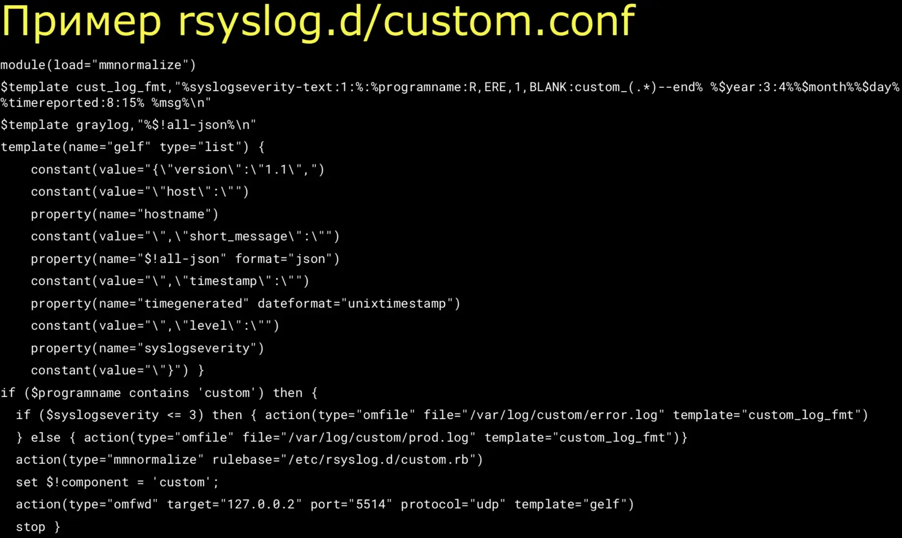
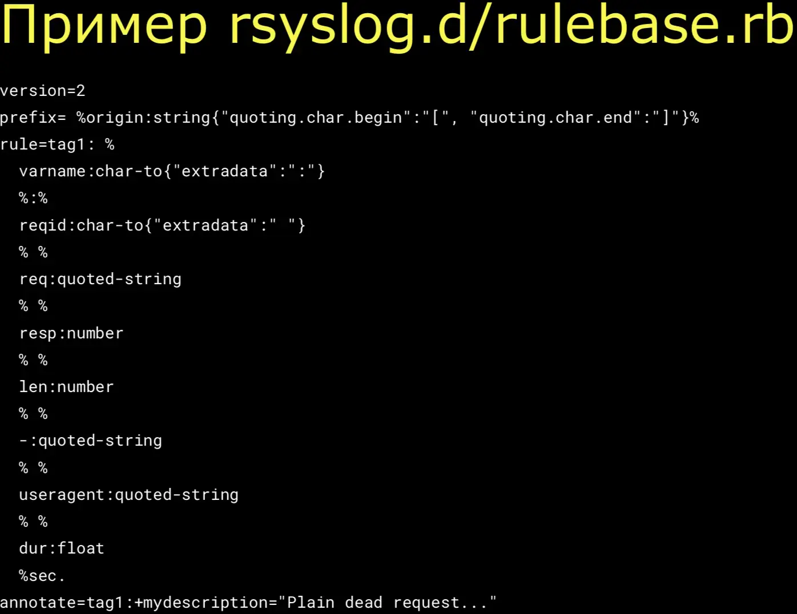

Суть: Обработка логов с помощью Filebeat и Logstash требует очень много ресурсов, лучше использовать rsyslog, который есть в каждом дистрибутиве, умеет все необходимое, работает очень быстро за счет ухода от регулярок.

<iframe class="rounded" width="560" height="315" src="https://www.youtube.com/embed/Iq0Nm_cc0wo" title="YouTube video player" frameborder="0" allow="accelerometer; autoplay; clipboard-write; encrypted-media; gyroscope; picture-in-picture" allowfullscreen></iframe>

## Обычно для обработки логов используют ELK

Сейчас этот стек уже стал FLEK(Filebeat, Logstash, ElasticSearch, Kibana).Filebeat читает логи, передает в Logstash, где их обрабатывает регулярками на java. Это требует очень много ресурсов.

## Можно заменить прожорливый L на Rsyslog

Rsyslog -- проект, давно включенный в минимальную поставку любого дистрибутива. Им можно и читать, и обрабатывать, и дополнять.

### Устройство rsyslog

Состоит из входных модулей, модулей обработки, выходных модулей. Модулей существует огромное количество, абсолютно под любую задачу.

Для парсинга используется модуль `mmnormalize`, который работает поверх библиотеки `liblognorm`(скоростной парсер). Он позволяет парсить многие вещи без регулярных выражений, за счет этого работает очень быстро. Был опыт обработки 250Гб/час(LA < 1% @ 56*Xeon 2.6GHz).

### Конфигурация rsyslog

Конфиг rsyslog описывается языком программирования RainerScript. Весь конфиг можно условно назвать программой, которая выполняется для каждой записи.
  
В нем нужно указать:
* какие модули нам нужно загрузить
* шаблон, по которому записываем логи, куда отправляем
* правила для liblognorm.
	* правил состоит из переменных и их типов. Например, `reqid:char-to("extrade":" ")` говорит что весь текст до пробела нужно поместить в поле `reqid`.
	* Такими правилами мы описываем сообщение. Сначала идет строка, затем число, затем число, и т.д. За счет описания сообщения такими правилами, мы уходим от регулярок и получаем ускоренеие.
	* Есть особенность. Если под шаблон, где ожидается число, пришли строка, то сообщение не будет обработано этим правилом, перейдет к следующему.
	* Через `annotate` указываем дополнительные поля.

Пример конфига для сервиса:

Пример конфига с правилами:

## Ссылки
* [Презентация](https://speakerdeck.com/devopsmoscow/rsyslog-kak-ia-pieriestal-boiat-sia-i-poliubil-obrabotku-loghov)
* [Запись трансляции](https://www.youtube.com/watch?v=Iq0Nm_cc0wo)
* [Rsyslog](https://rsyslog.com)
* [liblognorm](http://www.liblognorm.com/files/manual/configuration.html)
* [Efficient Normalization of IT Log Messages under Realtime Conditions](https://www.researchgate.net/publication/310545144_Efficient_Normalization_of_IT_Log_Messages_under_Realtime_Conditions)
* [Rsyslog: going up from 40K messages per second to 250K](https://www.researchgate.net/publication/228694459_Rsyslog_going_up_from_40K_messages_per_second_to_25K)
