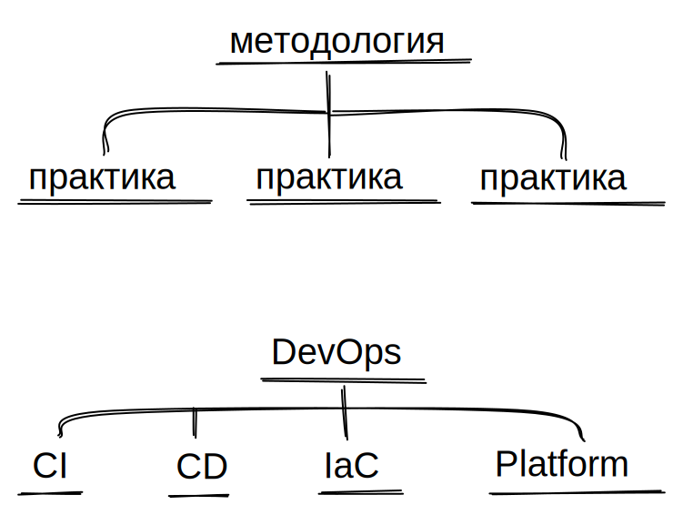
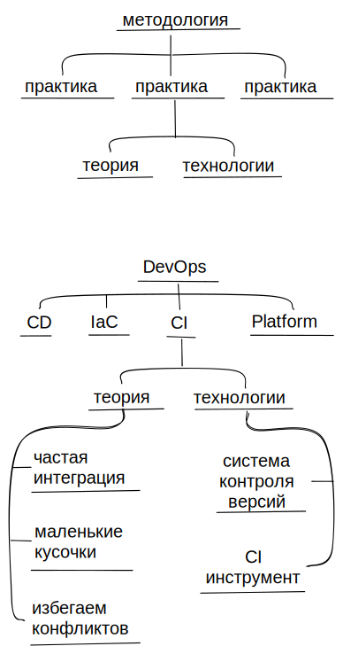

Часто можно услышать что **DevOps** это методология, а такие вещи как **Continuous Integration** и **Continuous Delivery** – практики. Разбираю почему это все называется именно так и какой в этом смысл.

## методология
У слова "методология" несколько разных определений, первым в голову чаще всего проходит прикладной научный вариант: "совокупность приемов исследования в науки и области знаний". Но разработка ПО это не исследование, поэтому в этом контексте имеется в виду "совокупность практик, необходимых для того чтобы совершить какую-то работу".

### практика
Понятие практики тоже имеет разные значения. Чаще всего мы слышим "отправили на практику" и имеем в виду что школа или вуз отправила человека заниматься каким-то неоплачиваемым трудом ради получения первого опыта. Или на курсах говорят что теория закончилась, перейдем к практике, т.е. к тому чтобы попробовать самостоятельно сделать задание.

В контексте методологии и разработки ПО под практикой подразумевается совокупность теории о том как совершить работу и набор инструментов, который для этого нужен.

Мой любимый пример – Continuous Integration. Мы понимаем что это практика, потому что она описывает как совершать работу и распадается на теорию и техническую части. Теория: объединяем изменения как можно чаще и маленькими кусочками, чтобы избежать сложностей объединения больших изменений и как можно раньше решить выявить проблемы совместимости. Техническая часть: система контроля версий, CI-инструмент для автоматического прогона тестов на каждый коммит.

