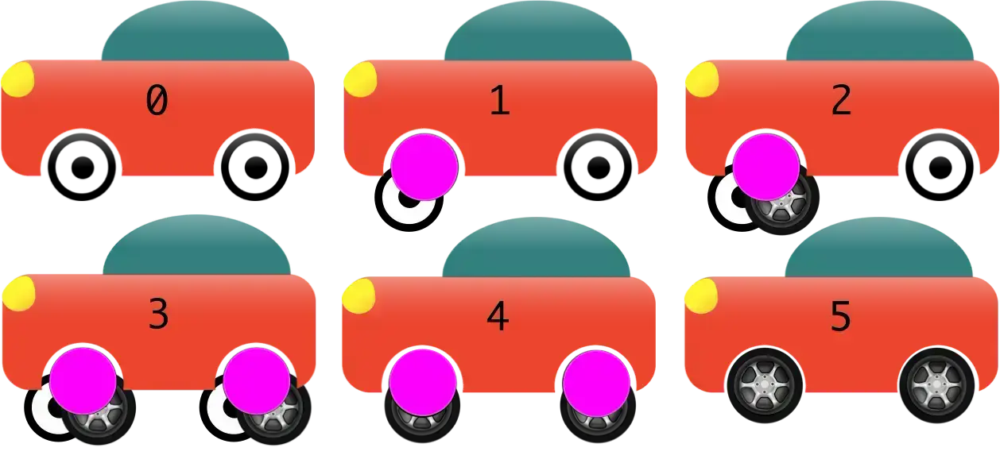

> Это пересказ моего доклада с новогоднего DevOps Moscow. Краткое содержание можно прочитать в блоге [enabling.team](https://enabling.team/insights/trunk-based-development-2018)

Суть: Trunk Based Development лучшая модель ветвления, потому что позволяет нам делать очень короткие итерации и деплоить все подряд за счет применение Feature Flags и Branch By Abstraction.

<iframe class="rounded" width="560" height="315" src="https://www.youtube.com/embed/hIW5ynk8HWc" title="YouTube video player" frameborder="0" allow="accelerometer; autoplay; clipboard-write; encrypted-media; gyroscope; picture-in-picture" allowfullscreen></iframe>

## Пруфы

* В State Of DevOps 2018 нашли корреляцию между применением Trunk Based Development и производительностью компаний(Elite и High Performers)
* Accerelate
* Доклад от Google "Why Google Stores Billions of Lines of Code in a Single Repository"

## Суть Trunk Based Development

Мы хотим тестировать бизнес-гипотезы как можно быстрее. Выдвинуть идею, реализовать, отдать пользователям, собрать фидбек. Trunk идеально для этого подходит.

* Ветки живут **МАКСИМУМ 2 ДНЯ**(кроме master)
* Feature Flags и Branch By Abstraction
* Continuous Code Review
* master всегда готов к деплою, даже если в нем есть неготовые фичи

### Feature Flags

Флаги запуска, которыми мы включаем или выключаем фичи.

#### Что дает Feature Flags

* Можем мержить и деплоить код, который еще не готов
* A/B тесты
* Шаринг кода между недоработанными фичами, за счет мержа всего кода в master

### Branch By Abstraction

Trunk Based Development предлагает вместо создание ветки для фич, создавать **ветку на изменение одной абстракции**.

Представим, что у нас есть объект машина, у которой есть абстракция "передние колоса" и "задние колеса", которые мы хотим заменить на другой тип колес. В случае с feature branch, мы бы отправили один Pull Request с реализацией нового типа колес, с Branch By Abstraction все немного сложнее.

1. Создаем ветку, оборачиваем переднее колесо в абстракцию, отправляем Pull Request, мержим
2. Создаем ветку, описываем новый тип передних колес и добавляем feature flag переключения типов колес, отправляем Pull Request, мержим
3. Создаем ветку, оборачиваем заднее колесо в абстракцию, отправляем Pull Request, мержим
4. Создаем ветку, описываем новый тип задних колес и добавляем feature flag переключения типов колес, отправляем Pull Request, мержим
5. Включили в проде новый тип колес, убедились, что все ок
6. Удаляем старые колеса отдельными Pull Request`ами

#### Что нам дает Branch By Abstraction

* Частые интеграции! Индустрия уже пришла к тому что нужно часто интегрировать маленькие кусочки кода(CI), теперь можно делать микрокусочки.
* Постепенное изменение/рефакторинг кода. Вместо переделки всего разом, меняем постепенно, шарим изменения до того как закончим большую задачу.
* Возможность оторваться от задачи. В случае, если нужно переключиться на другую задачу, мы можем смежить последнее изменения и вернуться к доработке потом.

### Continuous Code Review

Смотрим чужие PR, сразу после того как отправили свой. Из-за этого что PR маленькие(изменение одной абстракции), их ревью занимает пару минут! Если от создания PR до аппрува прошло 10 минут, то это приемлемый результат, если больше 1 часа, то это считается очень плохим результатом, нужно срочно улучшать.

#### Что дает Continuous Code Review

* Шаринг знаний. Все понимают как меняется сервис, переиспользуют код, подсказывают друг-другу лучшие практики
* Снижение тех долга за счет того что мы все рефракторим на ходу
* Ускорение поставки. Теперь PR весит не пару дней, а несколько минут и может сразу отправляться в прод.

### Все это очень сложно

* Нужно хорошее покрытие тестами, тогда можно будет все мержить в мастер и при этом быть уверенными, что он готов к деплою
* Feature Flags требуют инфраструктурных изменений. Мы теперь как-то должны кубером/ансиблом указывать что включаем, а что нет
* Branch by Abstraction требует навыков построения абстракций и декомпозиции. Это сложно! Нужно как минимум хорошее понимание SOLID

### Выводы

Trunk Based Development сложная, но лучшая модель ветвления, за счет того что она позволяет делать:

* Частые короткие итерации
* Деплоить даже неготовый код
* Непрерывно Шарить знания
* Делать ревью за пару минут

## Источники
* [State Of DevOps 2018](https://cloudplatformonline.com/2018-state-of-devops.html)
* [Accelerate](https://www.goodreads.com/book/show/35747076-accelerate)
* [TrunkBasedDevelopment](https://trunkbaseddevelopment.com/)
* [Why Google Stores Billions of Lines of Code in a Single Repository](https://www.youtube.com/watch?v=W71BTkUbdqE)
* [BranchByAbstraction Martin Fowler](https://www.martinfowler.com/bliki/BranchByAbstraction.html)
* [ParallelChange Danilo Sato](https://www.martinfowler.com/bliki/ParallelChange.html)

## Ссылки

* [Трансляция митапа](https://www.youtube.com/watch?v=Iq0Nm_cc0wo)
* [Слайды](https://github.com/aladmit/public/blob/main/pdfs/%D0%9F%D0%BE%D1%87%D0%B5%D0%BC%D1%83%20Trunk%20Based%20Development%20%D0%BB%D1%83%D1%87%D1%88%D0%B0%D1%8F%20%D0%BC%D0%BE%D0%B4%D0%B5%D0%BB%D1%8C%20%D0%B2%D0%B5%D1%82%D0%B2%D0%BB%D0%B5%D0%BD%D0%B8%D1%8F.pdf)
