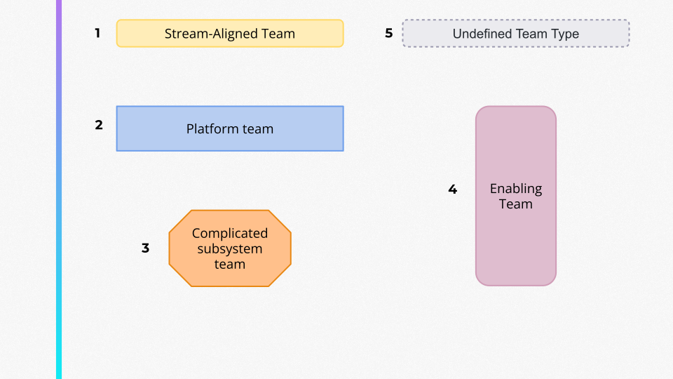
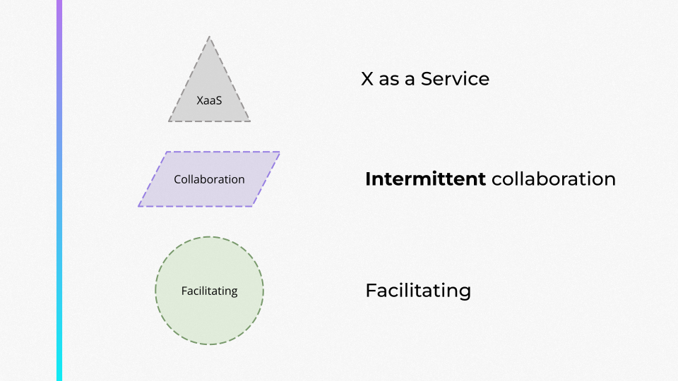
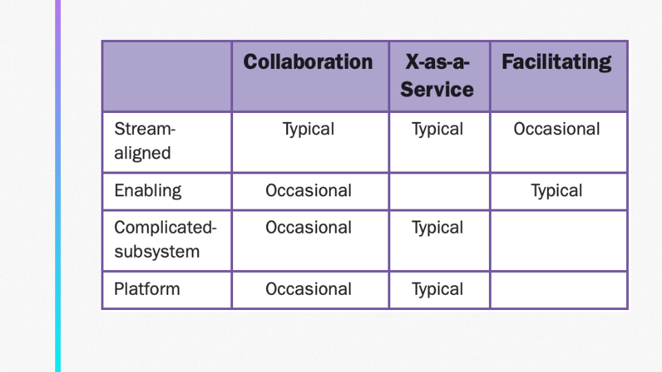
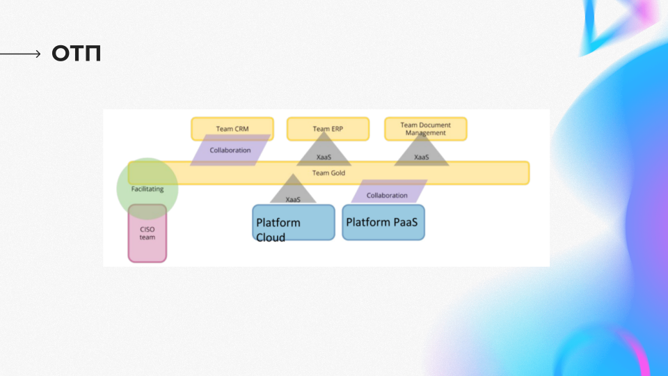
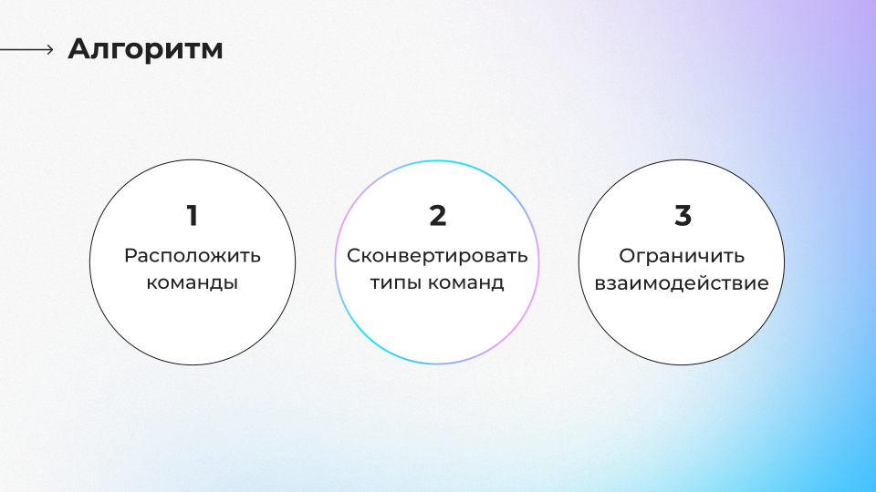
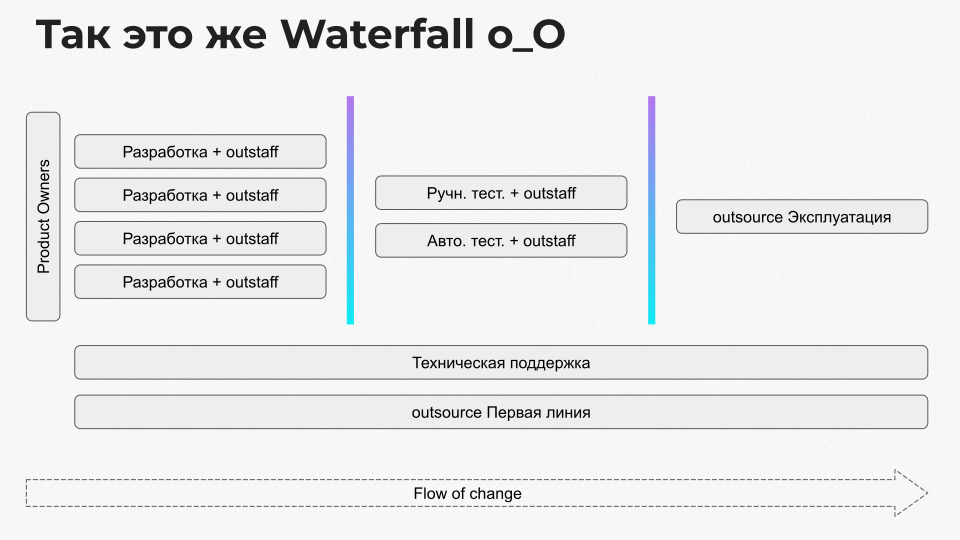
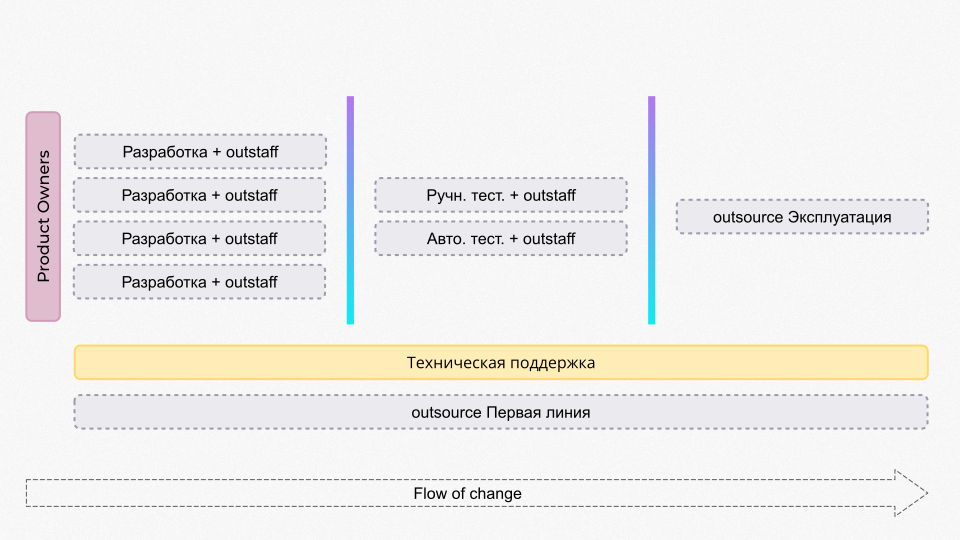
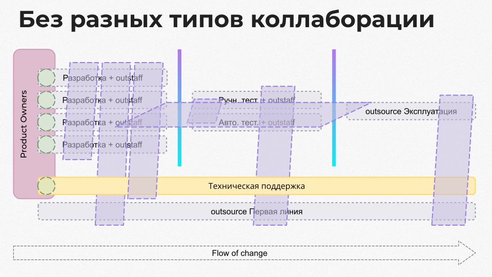
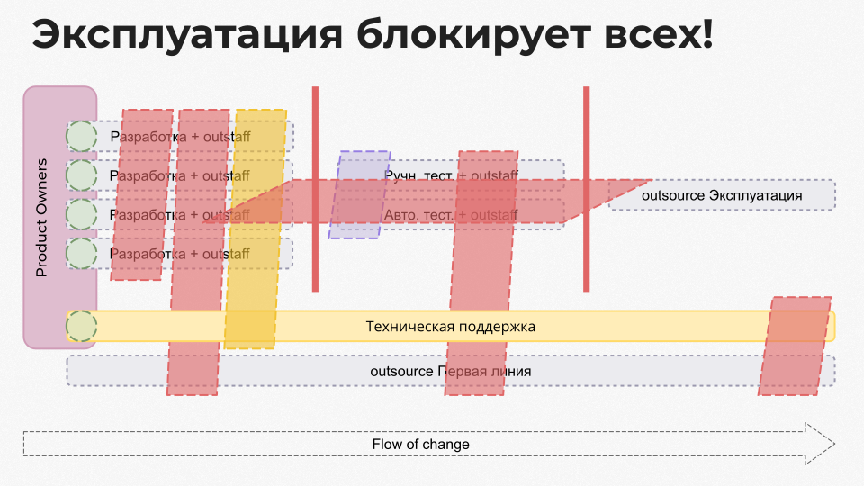

> Это пересказ моего доклада с AgileDays 2023. Краткое содержание можно прочитать в блоге [enabling.team](https://enabling.team/insights/team-dysfunctions-and-team-topologies)

<iframe class="rounded" width="560" height="315" src="https://www.youtube.com/embed/WBDGous4HKQ?si=LMReQZkrIXE6I4RY" title="YouTube video player" frameborder="0" allow="accelerometer; autoplay; clipboard-write; encrypted-media; gyroscope; picture-in-picture; web-share" referrerpolicy="strict-origin-when-cross-origin" allowfullscreen></iframe>

Team Topologies - подход к организации команд для ускорения потока создания ценности.

Когда в отделе много команд, то ускорить их работу внедрением новых технологий или обучением уже недостаточно. Работу отдела начинают замедлять зависимости между командами и необходимость во взаимодействии большого количества людей. Team Topologies позволяет смоделировать организацию отдела и выявить узкие места.

## Основа Team Topologies

Для моделирования Team Topologies предлагает пять типов команд:
- Stream-aligned Team — Продуктовые команды, создающие функции для бизнеса;
- Platform Team — Команды внутренней платформы, повышающие автономность других команд;
- Complicated Subsystem Team — Команды, работающие над сложными доменами (например, биллинг);
- Enabling Team — Команды, фасилитирующие изменения и обучающие другие команды;
- Undefined Team — Команды, которые не соответствуют указанным типам.

Три типа взаимодействия:
1. Предоставление услуг (Service) — Одна команда предоставляет ресурсы или услуги другим;
2. Временная коллаборация (Collaboration) — Временное совместное решение задач;
3. Фасилитация (Facilitation) — Поддержка других команд для ускорения их работы.

И таблицу способов взаимодействия типичных для всех типов команд:

### Примеры топологий в индустрии

## Кейс

Контекст компании:
- Около 50 микросервисов;
- Скрам с недельными спринтами;
- Взаимозависимости между командами.

Основные проблемы:
- Непредсказуемые сроки выполнения задач;
- Отсутствие прозрачности по состоянию задач;
- Постоянные блокировки между командами.

Шаги применения Team Topologies:

### 1. Расположить команды по потоку

Выписать все существующие команды компании, затем расположить их по потоку создания ценности. Места передачи результата работы из одной команды в другую отмечаем барьером.

На этом этапе обнаружилось что разработка идет этапами, передавая артефакт из отдела в отдел.

### 2. Пробуем конвертировать типы существующих команд

#### Product Owners -> enabling team?

Критерии enabling team команды:
- ✅ Проактивно помогает stream-aligned командам;
- ✅ Больше вовлекается, когда это нужно;
- ✅ Понимает, что будет нужно командам в будущем;
- ✅ Распространяет знания в командах.

В нашем случае команда product owners соответствовала всем этим критериями. Теперь обозначаем их как **enabling team**.
#### Команды разработки -> stream-aligned team?

Чаще всего команда разработки это stream-aligned команда. Пробуем конвертировать.

Критерии stream-aligned команды:
- ✅ Сонаправлена с бизнесом;
- ❌ Владеет своими сервисами;
- ❌ Ответственна за свой софт;
- ❌ Есть все необходимые для выполнения задач компетенции.

Проверив как работают команды разработки, выяснили что у команд все сервисы общие, нет четкой ответственности за свою часть системы, в командах не хватает компетенций для выполнения задачи от начала до конца. Обозначаем команды разработки как **undefined team**.

#### Команда эксплуатации -> platform team?

Критерии platform team:
- ❌ Повышает автономность команд;
- ❌ Делает сервисы для разработчиков;
- ❌ Продуктовый подход, разработчики — клиенты;
- ❌ Пользуются своими же сервисами.

В данном случае команда эксплуатации фокусировалась на закрытии тикетов и делала релизы руками, вместо повышения автономности команд разработки. Каких-то сервисов или продуктового подхода в команде не было, поэтому обозначаем как **undefined team**.

#### Команда первой линии -> platform team?

Так же как и команда эксплуатации, команда первой линии не выполняла ни один критерий platform team, поэтому на схеме обозначаем ее как **undefined team**.

#### Команды тестирования -> ??

Команды тестирования не подходят под основные 4 типа, поэтому их обозначаем как **undefined team**.

Почему не подходят? Они не создают продукт, как stream-aligned команды, не занимаются помощью другим или фасилитацией, как enabling team, не работают на повышение автономности, как platform team, не закрывают собой какую-то сложную область знаний как complicated subsystem. Получается что для них остается только 1 тип - **undefined team**.

#### Команда тех. поддержки -> ??

Неожиданно оказалось что команда тех поддержки это stream-aligned team. Она подошла под все критерии:
- ✅ Сонаправлена с бизнесом;
- ✅ Владеет своими сервисами;
- ✅ Ответственна за свой софт;
- ✅ Есть все необходимые для выполнения задач компетенции.

Команда тех поддержки полностью закрывала собой решение проблем пользователей, создавала и обслуживала собственные инструменты, была полностью автономной. Обозначаем ее как **stream-aligned team**.

#### Что в итоге получилось

### 3. Ограничить взаимодействие

В Team Topologies есть 3 типа взаимодействия команд и таблица, по которой можно понять какие взаимодействия типичны для каждого типа команд и их стоит оставить. А какие типы взаимодействия команде не свойственны и от них лучше отказаться, они ее замедляют.

Выявили все типы взаимодействия и обозначили их на схеме. Видно, что помимо поэтапной передачи артефактов все команды еще очень плотно взаимодействуют друг с другом.

#### Дополнительные типы коллаборации

На схеме выше видно, что между командами очень много коллабораций, но при этом невозможно понять какие из них полезные, ускоряющие работу, а какие замедляющие.

Для визуализации разных типов коллаборации мы добавили собственные обозначения:
1. Collaboration(фиолетовый) — временная коллаборация, как ее понимают в team topologies;
2. Замедляющее(желтый) — замедляет команду тем что создающее дополнительную нагрузку;
3. Блокирующие(красный) — команда не может работать над задачей, блокируется необходимостью взаимодействовать с другой командой.

Проанализировав и обозначив каждое взаимодействие между командами мы выяснили что команда эксплуатации участвует на всех этапах разработки и всех блокирует. Дальше мы будем повторять алгоритм применения Team Topologies для разблокирования команд.

## Чиним эксплуатацию через Team Topologies

1. Причина взаимодействия всех с эксплуатацией — ручное управление инфраструктурой. Нет деплоя через CI, сервисы не описаны через IaC. Для решения сформировали команду платформы, т.е. конвертировали команду эксплуатации по критериям platform team;
2. Первое время платформа активно взаимодействовала и замедляла разработку, чтобы сделать удобный командам деплой и управление конфигурацией;
3. Со временем ограничили способы взаимодействия до тех что типичны для platform team: X as Service.

Теперь команда эксплуатации занимается только предоставлением услуг и сервисов для других команд и не участвует в процессе поставки ценности. Эксплуатация больше не блокирует другие команды.

## Разблокируем тех. поддержку с Team Topologies

1. Видно, что тех. поддержка блокируется взаимодействием с первой линией. По табличке видим что у stream-aligned team не должно быть такого взаимодействия. Первопричина: первая линия через чат давала тех. поддержке разные данные из базы пользователей;
2. Через временную коллаборацию тех поддержки и платформы сделали интерфейс, через который тех. поддержка сама может получать нужные данные;
3. Интерфейс стал частью платформы, тех поддержка пользуется им как внешним сервисом и не блокируется.

## Разблокируем разработку от тестирования

Тестирование было отдельным этапом, на котором QA занимались ручным тестированием. Для разблокирования нужно было перенести возможность тестирования в команды разработки.

1. Часть QA занялась разработкой BDD фреймворка для интеграционного тестирования;
2. Когда с помощью фреймворка стало возможно тестировать базовые сценарии, тестировщиков переместили в команды разработки;
3. Какое-то время использования фреймворка в командах замедляло разработку, в нем не хватало возможностей для описания текущего и нового функционала;
4. Когда возможностей фреймворка стало достаточно, участие команды фреймворка в разработки больше было не нужно.

## Разблокируем команды разработки друг от друга

Остался последний блокер — взаимодействие команд разработки между собой. Причины такого взаимодействия были следующие:
1. Большое количество сильно связанных сервисов;
2. Компания часто меняла перемещала людей между командами, из-за чего у людей не накапливалась экспертиза;
3. Задачи постоянно перекидывались между командами по принципу "в другой команде есть человек, который лучше знает этот сервис".

Переделывание бекенда, полное владение сервисов командами и проведение жестких границ ответственности — большая задача, которая решалась уже без моего участия. Но компания сделала выводы и второе направление бизнеса запустила уже с учетом этих ошибок:

## Результат

## Ссылки

- [Team Topologies](https://teamtopologies.com/)
- [Запись доклада](https://www.youtube.com/embed/WBDGous4HKQ?si=LMReQZkrIXE6I4RY)
- [Презентация](https://github.com/aladmit/public/blob/main/pdfs/%D0%9A%D0%B5%D0%B9%D1%81%20%D0%BF%D0%BE%D0%B8%D1%81%D0%BA%D0%B0%20%D0%B4%D0%B8%D1%81%D1%84%D1%83%D0%BD%D0%BA%D1%86%D0%B8%D0%B9%20%D0%BA%D0%BE%D0%BC%D0%B0%D0%BD%D0%B4%20%D0%B8%20%D0%B8%D1%85%20%D1%80%D0%B5%D1%88%D0%B5%D0%BD%D0%B8%D1%8F%20%D1%81%20Team%20Topologies.pdf)
